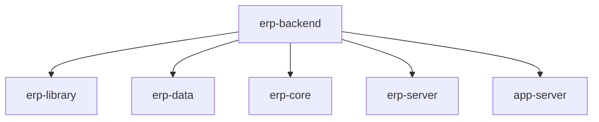

# 基础信息

|      |      |
|------|------|
| 名称 | erp-backend |
| 编码语言 | .java |
| 代码路径 | erp-backend |
| 包名 | erp-backend |
| 概述说明 | ERP系统后端模块，涵盖JSON处理、日志、权限、缓存、数据库等核心功能，支持高并发与复杂业务场景。 |

# 说明

## 概述
该代码模块是一个企业资源规划（ERP）系统的后端实现，涵盖多个子模块，包括核心库、数据管理、核心功能、服务器和应用服务器。模块基于Java语言开发，集成了Vert.x、Hazelcast和MySQL等技术，旨在提供高效、可扩展且易于维护的基础架构。模块通过模块化设计，支持多种功能，如JSON数据处理、日志记录、应用上下文管理、控制器逻辑、API请求与响应处理、模块管理、权限管理、缓存管理、异常处理、会话管理、工具类、数据库操作以及密钥库管理等。这些功能共同支持ERP系统的核心业务操作，确保系统能够应对复杂的业务需求和高并发的系统场景。

## 主要业务场景
1. **JSON数据处理**：模块提供了JSON序列化和反序列化功能，支持Java对象与JSON格式之间的转换，便于数据交换和持久化。
2. **日志记录**：通过集成的日志服务，模块支持多种日志级别，确保系统运行信息的全面记录和监控。
3. **应用上下文管理**：模块通过`AppContext`接口及其实现类，统一管理Vertx、Hazelcast、数据库、缓存、权限等关键组件，确保系统资源的高效利用。
4. **控制器逻辑处理**：模块提供了控制器基类`AbstractController`，支持处理与Vertx框架相关的请求和响应逻辑，确保业务逻辑的正确执行。
5. **API请求与响应处理**：模块通过`ApiRequest`、`ApiResponse`等类，支持API请求的编码、解码、管理和响应封装，确保数据交换的完整性和安全性。
6. **模块管理**：模块通过`IModule`接口和`AbstractModule`抽象类，支持模块的集成、管理和初始化，提供统一的框架支持。
7. **权限管理**：模块通过`PermissionRequired`、`LoginRequired`等注解，支持权限控制、登录验证和日志注入，确保系统的安全性和合规性。
8. **缓存管理**：模块提供了多种缓存类型的实现，包括文件缓存、本地内存缓存和Hazelcast分布式缓存，支持高效的数据访问和资源管理。
9. **异常处理**：模块定义了一系列自定义异常类，用于处理服务、仓库、缓存缺失等情况，确保系统的健壮性和可维护性。
10. **会话管理**：模块利用Hazelcast技术实现分布式会话管理，支持用户会话的高效存储、检索和管理，确保会话数据的高可用性和一致性。
11. **工具类**：模块提供了多种实用工具类，支持哈希计算、JSON数据转换、文件操作等功能，简化开发流程并提高代码效率。
12. **数据库操作**：模块支持与MySQL和Hazelcast数据库的交互，提供数据库连接、仓库管理、事务处理等功能，确保数据的一致性和完整性。
13. **密钥库管理**：模块支持生成自签名X.509证书并将其保存为JKS格式的密钥库，适用于安全通信和数据加密。
14. **用户登录与身份验证**：模块处理用户的登录、登出及登录状态检查，通过验证用户输入的用户名和密码来确认身份，并管理用户的会话状态，确保用户身份验证的安全性。
15. **菜单管理**：模块通过缓存和数据库查询的方式，按ID列出菜单项，确保菜单项数据的及时性和准确性。
16. **群组管理**：模块管理群组数据，提供获取特定群组、用户所属群组列表以及群组ID的功能，优化了群组数据的查询性能。
17. **加法运算**：模块通过`/add_integer`路径接收整数参数，并返回这些参数的和，提供简洁的加法运算功能。
18. **API网关管理**：模块通过`DefaultApiGateway`实现，负责初始化Vertx框架、配置日志系统以及事件总线，确保在高并发场景下系统的性能和稳定性。
19. **集群部署与高可用性**：模块通过整合Vert.x和Hazelcast技术，支持集群部署，确保系统在高负载和高并发情况下的高可用性和性能。
20. **应用服务器启动与模块部署**：模块负责创建并启动应用服务器，确保服务器正确运行后才会继续部署相关模块。

通过这些功能，该模块为ERP系统提供了全面的支持，能够满足复杂的业务需求和高并发的系统场景。

### 包内部结构视图

该流程图展示了`erp-backend`项目的目录结构，其中`erp-backend`作为根目录，包含了`erp-library`、`erp-data`、`erp-core`、`erp-server`和`app-server`五个子模块。每个子模块均直接隶属于`erp-backend`，反映了项目的主要模块划分。

# 文件列表 File List

| 名称   | 类型  | 说明 |
|-------|------|-------------|
| [erp-data](erp-data/src/main/java/com/_module.md) | module | ERP核心数据模块管理权限、群组、菜单、用户等数据，优化查询性能，支持数据序列化。 |
| [erp-library](erp-library/src/main/java/com.jukusoft/_module.md) | module | ERP后端库提供JSON处理、日志记录、权限管理等功能，支持复杂业务需求。 |
| [app-server](app-server/src/main/java/com/_module.md) | module | DefaultAppServer类管理Vert.x集群、Hazelcast、数据库连接、缓存和模块部署。 |
| [erp-server](erp-server/src/main/java/com/_module.md) | module | ResponseGenerator生成JSON响应，DefaultApiGateway管理请求流程，ERPServer集成多种技术支持集群部署。 |
| [erp-core](erp-core/src/main/java/com/_module.md) | module | ERP核心模块集成用户登录、权限管理、菜单管理、缓存管理、群组管理及加法运算功能。 |

