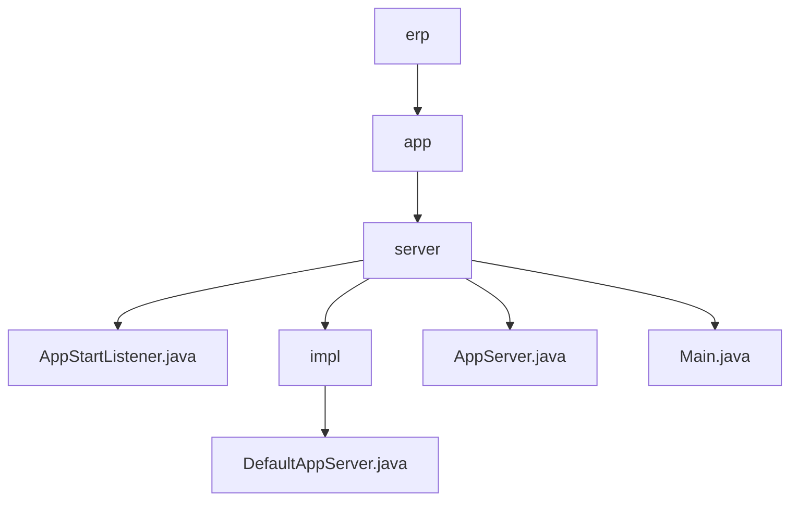

# 基础信息

|      |      |
|------|------|
| 名称 | erp |
| 编码语言 | .java |
| 代码路径 | erp-backend/app-server/src/main/java/com/jukusoft/erp |
| 包名 | erp-backend.app-server.src.main.java.com.jukusoft.erp |
| 概述说明 | DefaultAppServer类管理Vert.x集群、Hazelcast、数据库连接、缓存和模块部署。 |

# 说明

## 概述

该代码模块是一个ERP系统的后端应用服务器，主要负责应用服务器的启动、集群管理、分布式数据存储、数据库连接、缓存管理以及模块部署等功能。模块的核心类包括`DefaultAppServer`和`AppServer`，它们共同协作以确保系统的稳定运行和高效管理。

## 主要业务场景

1. **应用服务器启动与模块部署**：
   - `Main.java`负责创建并启动应用服务器。如果启动成功，则会部署三个模块；如果启动失败，则直接退出，以避免潜在问题。
   - `AppServer.java`定义了应用服务器的接口，确保服务器正确运行后才会继续部署相关模块。

2. **集群管理与分布式通信**：
   - `DefaultAppServer`类实现了`AppServer`接口，负责管理Vert.x集群，确保分布式系统的协调与通信。

3. **分布式数据存储与计算**：
   - `DefaultAppServer`类还管理Hazelcast实例，支持分布式数据存储和计算，确保数据的高效访问和处理。

4. **数据库连接与缓存管理**：
   - `DefaultAppServer`类负责数据库连接的配置和维护，确保数据访问的稳定性和高效性。同时，它还管理缓存，以提升系统性能。

5. **模块部署与系统管理**：
   - `DefaultAppServer`类处理模块的部署，确保各个功能模块能够正确加载和运行，从而保证系统的完整性和功能性。

通过以上功能，该模块确保了ERP系统后端的稳定运行和高效管理，支持分布式计算、数据存储、数据库访问以及模块化部署等关键业务场景。

### 包内部结构视图

该流程图展示了ERP后端项目中`app-server`模块的代码结构。`erp`作为根节点，包含`app`子模块，`app`进一步包含`server`子模块。`server`模块下包含多个Java文件，如`AppStartListener.java`、`AppServer.java`和`Main.java`，以及`impl`子模块，`impl`模块中包含了`DefaultAppServer.java`文件。整个结构清晰地反映了模块之间的层级关系和文件分布。

# 文件列表 File List

| 名称   | 类型  | 说明 |
|-------|------|-------------|
| [app](app/_module.md) | package | DefaultAppServer类管理Vert.x集群、Hazelcast、数据库连接、缓存和模块部署。 |

