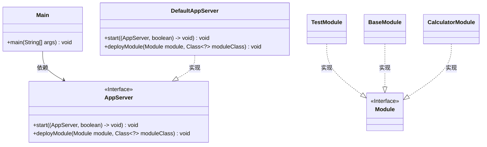
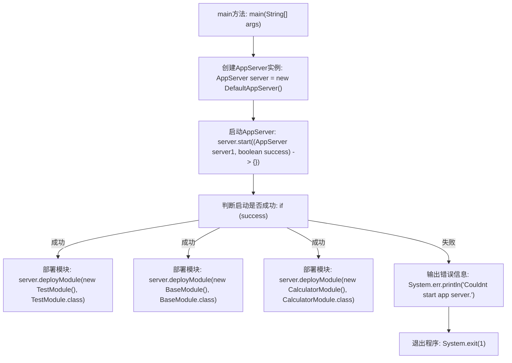

# 基础信息

|      |      |
|------|------|
| 名称 | Main |
| 编码语言 | .java |
| 代码路径 | erp-backend/app-server/src/main/java/com/jukusoft/erp/app/server/Main.java |
| 包名 | com.jukusoft.erp.app.server |
| 依赖项 | ['com.jukusoft.erp.app.server.impl.DefaultAppServer', 'com.jukusoft.erp.core.module.calculator.CalculatorModule', 'com.jukusoft.erp.core.module.test.TestModule', 'com.jukusoft.erp.core.module.base.BaseModule'] |
| 概述说明 | 创建启动应用服务器，成功部署三模块，失败退出。 |

# 说明

创建并启动应用服务器，若操作成功则部署三个模块，若失败则直接退出。该流程确保应用服务器正确运行后，才会继续部署相关模块，否则立即终止操作以避免潜在问题。

# 类列表 Class Summary

| 名称   | 类型  | 说明 |
|-------|------|-------------|
| Main | class | 创建并启动应用服务器，成功时部署三个模块，失败则退出。 |

## 类 Main

|      |      |
|------|------|
| 访问范围 | public |
| 类型 | class |
| 名称 | Main |
| 说明 | 创建并启动应用服务器，成功时部署三个模块，失败则退出。 |

### UML类图

这段代码展示了一个简单的应用程序启动流程。`Main`类通过`DefaultAppServer`实现`AppServer`接口，启动服务器并部署多个模块（`TestModule`、`BaseModule`、`CalculatorModule`）。`AppServer`接口定义了启动和部署模块的方法，而`DefaultAppServer`是其具体实现。各个模块类实现了`Module`接口，展示了模块化设计的典型应用。

### 内部方法调用关系图

这段代码描述了一个简单的应用程序服务器启动流程。首先，程序创建了一个`AppServer`实例，然后尝试启动服务器。如果启动成功，程序会依次部署三个模块：`TestModule`、`BaseModule`和`CalculatorModule`。如果启动失败，程序会输出错误信息并退出。流程图清晰地展示了每个步骤的执行顺序和条件分支。

### 字段列表 Field List

| 名称  | 类型  | 说明 |
|-------|-------|------|

### 方法列表 Method List

| 名称  | 类型  | 说明 |
|-------|-------|------|
| main | void | 创建并启动应用服务器，成功时部署多个模块，失败则退出程序。 |

