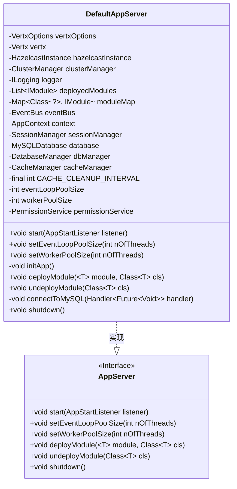

# 基础信息

|      |      |
|------|------|
| 名称 | DefaultAppServer |
| 编码语言 | .java |
| 代码路径 | erp-backend/app-server/src/main/java/com/jukusoft/erp/app/server/impl/DefaultAppServer.java |
| 包名 | com.jukusoft.erp.app.server.impl |
| 依赖项 | ['com.hazelcast.config.CacheSimpleConfig', 'com.hazelcast.config.Config', 'com.hazelcast.core.Hazelcast', 'com.hazelcast.core.HazelcastInstance', 'com.jukusoft.erp.app.server.AppServer', 'com.jukusoft.erp.app.server.AppStartListener', 'com.jukusoft.erp.lib.cache.CacheManager', 'com.jukusoft.erp.lib.cache.CacheTypes', 'com.jukusoft.erp.lib.cache.ICache', 'com.jukusoft.erp.lib.context.AppContext', 'com.jukusoft.erp.lib.context.AppContextImpl', 'com.jukusoft.erp.lib.database.DatabaseManager', 'com.jukusoft.erp.lib.database.MySQLDatabase', 'com.jukusoft.erp.lib.database.impl.DatabaseManagerImpl', 'com.jukusoft.erp.lib.logger.HzLogger', 'com.jukusoft.erp.lib.logging.ILogging', 'com.jukusoft.erp.lib.message.request.ApiRequest', 'com.jukusoft.erp.lib.message.request.ApiRequestCodec', 'com.jukusoft.erp.lib.message.response.ApiResponse', 'com.jukusoft.erp.lib.message.response.ApiResponseCodec', 'com.jukusoft.erp.lib.module.IModule', 'com.jukusoft.erp.lib.permission.PermissionManager', 'com.jukusoft.erp.lib.permission.PermissionService', 'com.jukusoft.erp.lib.session.SessionManager', 'io.vertx.core', 'io.vertx.core.eventbus.EventBus', 'io.vertx.core.json.JsonObject', 'io.vertx.core.spi.cluster.ClusterManager', 'io.vertx.spi.cluster.hazelcast.HazelcastClusterManager', 'java.io.File', 'java.io.IOException', 'java.util.ArrayList', 'java.util.HashMap', 'java.util.List', 'java.util.Map'] |
| 概述说明 | DefaultAppServer类实现AppServer接口，管理集群、实例、连接、缓存和部署。 |

# 说明

DefaultAppServer类实现了AppServer接口，负责管理多个关键系统组件和功能。它主要负责Vert.x集群的管理，确保分布式系统的协调与通信。同时，该类还管理Hazelcast实例，支持分布式数据存储和计算。此外，它负责数据库连接的配置和维护，确保数据访问的稳定性和高效性。缓存管理也是其职责之一，用于提升系统性能。最后，DefaultAppServer类还处理模块的部署，确保各个功能模块能够正确加载和运行。

# 类列表 Class Summary

| 名称   | 类型  | 说明 |
|-------|------|-------------|
| DefaultAppServer | class | DefaultAppServer类实现AppServer接口，管理Vert.x集群、Hazelcast实例、数据库连接、缓存和模块部署等功能。 |

## 类 DefaultAppServer

|      |      |
|------|------|
| 访问范围 | public |
| 类型 | class |
| 名称 | DefaultAppServer |
| 说明 | DefaultAppServer类实现AppServer接口，管理Vert.x集群、Hazelcast实例、数据库连接、缓存和模块部署等功能。 |

### UML类图

**描述**：`DefaultAppServer` 类实现了 `AppServer` 接口，负责管理应用程序服务器的启动、模块部署、数据库连接、缓存清理等核心功能。它依赖于多个外部组件，如 `Vertx`、`HazelcastInstance`、`MySQLDatabase` 和 `CacheManager`，并通过事件驱动的方式处理模块的部署和卸载。`DefaultAppServer` 还提供了对事件循环池和工作者线程池大小的配置，并支持异步的数据库连接和缓存清理操作。

### 内部方法调用关系图

```mermaid
graph TD
    A["类DefaultAppServer"]
    B["属性: VertxOptions vertxOptions"]
    C["属性: Vertx vertx"]
    D["属性: HazelcastInstance hazelcastInstance"]
    E["属性: ClusterManager clusterManager"]
    F["属性: ILogging logger"]
    G["属性: List<IModule> deployedModules"]
    H["属性: Map<Class<?>, IModule> moduleMap"]
    I["属性: EventBus eventBus"]
    J["属性: AppContext context"]
    K["属性: SessionManager sessionManager"]
    L["属性: MySQLDatabase database"]
    M["属性: DatabaseManager dbManager"]
    N["属性: CacheManager cacheManager"]
    O["属性: int CACHE_CLEANUP_INTERVAL"]
    P["属性: int eventLoopPoolSize"]
    Q["属性: int workerPoolSize"]
    R["属性: PermissionService permissionService"]
    S["方法: start(AppStartListener listener)"]
    T["方法: setEventLoopPoolSize(int nOfThreads)"]
    U["方法: setWorkerPoolSize(int nOfThreads)"]
    V["方法: initApp()"]
    W["方法: deployModule(T module, Class<T> cls)"]
    X["方法: undeployModule(Class<T> cls)"]
    Y["方法: connectToMySQL(Handler<Future<Void>> handler)"]
    Z["方法: shutdown()"]

    A --> B
    A --> C
    A --> D
    A --> E
    A --> F
    A --> G
    A --> H
    A --> I
    A --> J
    A --> K
    A --> L
    A --> M
    A --> N
    A --> O
    A --> P
    A --> Q
    A --> R
    A --> S
    A --> T
    A --> U
    A --> V
    A --> W
    A --> X
    A --> Y
    A --> Z
```

这段代码定义了一个名为 `DefaultAppServer` 的类，实现了 `AppServer` 接口。该类负责管理应用程序服务器的启动、配置、模块部署和关闭等操作。通过使用 Vert.x 和 Hazelcast 实现集群管理和事件驱动架构，代码中还包含了数据库连接、缓存管理、权限服务等功能。`start` 方法负责初始化服务器，`initApp` 方法用于初始化应用程序上下文，`deployModule` 和 `undeployModule` 方法分别用于部署和卸载模块，`shutdown` 方法用于关闭服务器。

### 字段列表 Field List

| 名称  | 类型  | 说明 |
|-------|-------|------|
| dbManager = null | DatabaseManager | 声明一个受保护的DatabaseManager实例变量dbManager，初始值为null。 |
| vertxOptions = null | VertxOptions | VertxOptions对象被声明为null。 |
| vertx = null | Vertx | Vertx实例被声明为受保护的静态变量且初始化为空。 |
| CACHE_CLEANUP_INTERVAL = 60000 | int | 保护型常量CACHE_CLEANUP_INTERVAL值为60000。 |
| moduleMap = new HashMap<>() | Map<Class<?>,IModule> | 声明并初始化一个用于存储类与模块映射的哈希表。 |
| eventLoopPoolSize = 2 | int | 事件循环池大小设为2的受保护整型变量。 |
| deployedModules = new ArrayList<>() | List<IModule> | 声明并初始化一个受保护的类型为IModule的模块列表。 |
| sessionManager = null | SessionManager | 声明受保护的SessionManager实例变量，初始化为null。 |
| workerPoolSize = 2 | int | 保护型整数变量workerPoolSize初始值为2。 |
| eventBus = null | EventBus | 保护类型EventBus变量eventBus初始化为null。 |
| cacheManager = null | CacheManager | 声明并初始化受保护的CacheManager对象为null。 |
| database = null | MySQLDatabase | 声明了一个受保护的MySQL数据库对象，初始值为null。 |
| permissionService = null | PermissionService | 声明受保护的PermissionService对象permissionService并初始化为null。 |
| context = null | AppContext | 声明并初始化受保护的AppContext对象为null。 |
| hazelcastInstance = null | HazelcastInstance | Hazelcast实例初始化为空。 |
| logger = null | ILogging | 声明一个受保护的日志记录器变量，初始值为空。 |
| clusterManager = null | ClusterManager | 声明受保护的ClusterManager对象clusterManager并初始化为null。 |

### 方法列表 Method List

| 名称  | 类型  | 说明 |
|-------|-------|------|
| setWorkerPoolSize | void | 重写方法设置线程池大小为指定值。 |
| shutdown | void | 关闭应用服务器并记录日志，处理成功或失败结果。 |
| deployModule | void | 部署模块方法，检查模块和vertx状态，初始化并启动模块，记录部署结果。 |
| connectToMySQL | void | 连接MySQL数据库的异步方法，使用配置文件并处理连接结果。 |
| start | void | 启动本地Hazelcast实例，配置集群管理器，创建Vert.x实例，连接数据库并初始化应用。 |
| initApp | void | 初始化应用服务器，注册消息编解码器，创建会话和权限服务，设置缓存清理监听器及定时任务。 |
| undeployModule | void | 该方法用于卸载指定模块，检查存在性后移除并停止模块，记录成功或错误信息。 |
| setEventLoopPoolSize | void | 重写方法，设置事件循环池线程数为指定值。 |

