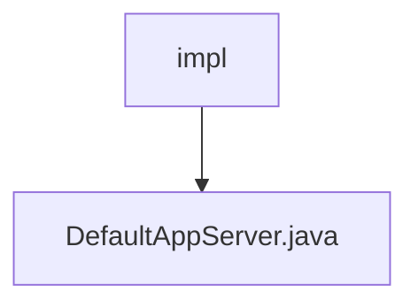

# 基础信息

|      |      |
|------|------|
| 名称 | impl |
| 编码语言 | .java |
| 代码路径 | erp-backend/app-server/src/main/java/com/jukusoft/erp/app/server/impl |
| 包名 | erp-backend.app-server.src.main.java.com.jukusoft.erp.app.server.impl |
| 概述说明 | DefaultAppServer类实现AppServer接口，管理集群、实例、连接、缓存和部署。 |

# 说明

DefaultAppServer类实现了AppServer接口，负责管理多个关键系统组件和功能。它主要负责Vert.x集群的管理，确保分布式系统的协调与通信。同时，该类还管理Hazelcast实例，支持分布式数据存储和计算。此外，它负责数据库连接的配置和维护，确保数据访问的稳定性和高效性。缓存管理也是其职责之一，用于提升系统性能。最后，DefaultAppServer类还处理模块的部署，确保各个功能模块能够正确加载和运行。

### 包内部结构视图

该流程图展示了`impl`文件夹与`DefaultAppServer.java`文件之间的层级关系。`impl`文件夹是`DefaultAppServer.java`文件的父级目录，表示该文件位于`impl`文件夹内。这种结构常用于组织Java项目中的实现类，确保代码逻辑清晰且易于维护。

# 文件列表 File List

| 名称   | 类型  | 说明 |
|-------|------|-------------|
| [DefaultAppServer.java](DefaultAppServer.md) | file | DefaultAppServer类实现AppServer接口，管理集群、实例、连接、缓存和部署。 |

