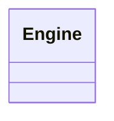

# 基础信息

|      |      |
|------|------|
| 名称 | Engine |
| 编码语言 | .java |
| 代码路径 | erp-backend/erp-core/src/main/java/com/jukusoft/erp/core/Engine.java |
| 包名 | com.jukusoft.erp.core |
| 依赖项 | [] |
| 概述说明 | 定义了一个公共类Engine。 |

# 说明

定义了一个名为Engine的公共类。这个类具有公共访问权限，意味着它可以在其他类或模块中被访问和使用。Engine类的具体功能和属性在定义中未详细说明，但作为一个公共类，它可能被设计为包含与引擎相关的核心功能或数据。该类的定义为进一步扩展和实现其功能提供了基础。

# 类列表 Class Summary

| 名称   | 类型  | 说明 |
|-------|------|-------------|
| Engine | class | 定义了一个名为Engine的公共类。 |

## 类 Engine

|      |      |
|------|------|
| 访问范围 | public |
| 类型 | class |
| 名称 | Engine |
| 说明 | 定义了一个名为Engine的公共类。 |

### UML类图

这段代码定义了一个名为 `Engine` 的类，该类目前没有任何成员变量或方法。它是一个空类，可能用于后续扩展或作为其他类的基类。

### 内部方法调用关系图

这段代码定义了一个名为 `Engine` 的类。由于代码片段非常简短，仅包含类的声明，因此流程图仅展示了一个节点，表示 `Engine` 类的存在。该类目前没有定义任何属性或方法，未来可以根据需求进一步扩展其功能。

### 字段列表 Field List

| 名称  | 类型  | 说明 |
|-------|-------|------|

### 方法列表 Method List

| 名称  | 类型  | 说明 |
|-------|-------|------|

