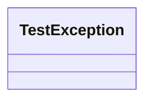

# 基础信息

|      |      |
|------|------|
| 名称 | TestException |
| 编码语言 | .java |
| 代码路径 | erp-backend/erp-core/src/main/java/com/jukusoft/erp/core/exception/TestException.java |
| 包名 | com.jukusoft.erp.core.exception |
| 依赖项 | [] |
| 概述说明 | 定义公共类TestException。 |

# 说明

定义了一个名为TestException的公共类，该类通常用于表示测试过程中可能发生的异常情况。作为公共类，TestException可以在项目的其他部分被访问和引用，以便在测试失败或出现错误时抛出和捕获异常。这种设计有助于提高代码的可维护性和可读性，使得异常处理更加明确和集中。

# 类列表 Class Summary

| 名称   | 类型  | 说明 |
|-------|------|-------------|
| TestException | class | 定义了一个名为TestException的公共类。 |

## 类 TestException

|      |      |
|------|------|
| 访问范围 | public |
| 类型 | class |
| 名称 | TestException |
| 说明 | 定义了一个名为TestException的公共类。 |

### UML类图

类图描述：`TestException` 是一个简单的空类，没有定义任何成员变量或方法。它可能用于表示某种异常情况，但当前代码中未提供具体实现。这个类可以作为一个基础异常类，后续可以通过继承扩展其功能。

### 内部方法调用关系图

这段代码定义了一个名为 `TestException` 的类，该类目前没有任何属性或方法。它是一个空类，可能用于后续扩展或作为异常处理的基类。由于代码结构非常简单，流程图仅包含一个节点，表示类的定义。

### 字段列表 Field List

| 名称  | 类型  | 说明 |
|-------|-------|------|

### 方法列表 Method List

| 名称  | 类型  | 说明 |
|-------|-------|------|

