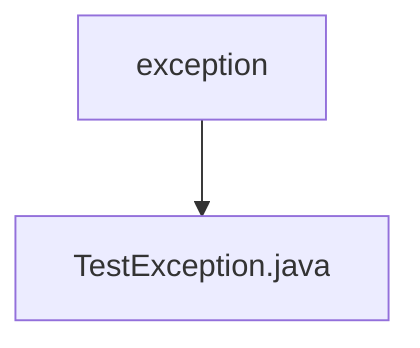

# 基础信息

|      |      |
|------|------|
| 名称 | exception |
| 编码语言 | .java |
| 代码路径 | erp-backend/erp-core/src/main/java/com/jukusoft/erp/core/exception |
| 包名 | erp-backend.erp-core.src.main.java.com.jukusoft.erp.core.exception |
| 概述说明 | 定义公共类TestException。 |

# 说明

定义了一个名为TestException的公共类，该类通常用于表示测试过程中可能发生的异常情况。作为公共类，TestException可以在项目的其他部分被访问和引用，以便在测试失败或出现错误时抛出和捕获异常。这种设计有助于提高代码的可维护性和可读性，使得异常处理更加明确和集中。

### 包内部结构视图

该流程图展示了 `erp-core` 项目中 `exception` 文件夹与其包含的 `TestException.java` 文件之间的层级关系。`exception` 是父节点，`TestException.java` 是其子节点，表示该文件位于 `exception` 文件夹内。

# 文件列表 File List

| 名称   | 类型  | 说明 |
|-------|------|-------------|
| [TestException.java](TestException.md) | file | 定义公共类TestException。 |

