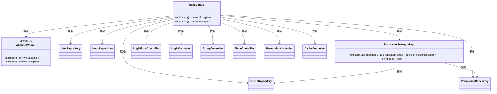

# 基础信息

|      |      |
|------|------|
| 名称 | BaseModule |
| 编码语言 | .java |
| 代码路径 | erp-backend/erp-core/src/main/java/com/jukusoft/erp/core/module/base/BaseModule.java |
| 包名 | com.jukusoft.erp.core.module.base |
| 依赖项 | ['com.jukusoft.data.repository.GroupRepository', 'com.jukusoft.data.repository.MenuRepository', 'com.jukusoft.data.repository.PermissionRepository', 'com.jukusoft.data.repository.UserRepository', 'com.jukusoft.erp.core.module.base.service.cache.CacheController', 'com.jukusoft.erp.core.module.base.service.group.GroupController', 'com.jukusoft.erp.core.module.base.service.login.LoginController', 'com.jukusoft.erp.core.module.base.service.loginform.LoginFormController', 'com.jukusoft.erp.core.module.base.service.menu.MenuController', 'com.jukusoft.erp.core.module.base.service.permission.PermissionController', 'com.jukusoft.erp.core.permission.PermissionManagerImpl', 'com.jukusoft.erp.lib.module.AbstractModule'] |
| 概述说明 | BaseModule继承AbstractModule，初始化时添加仓库、设置权限管理器并注册控制器。 |

# 说明

BaseModule类继承自AbstractModule，在初始化过程中执行了多项操作。首先，它添加了多个仓库，这些仓库可能用于存储和管理数据。其次，它设置了权限管理器，负责处理系统的权限控制和访问管理。最后，它注册了多个控制器，这些控制器用于处理请求和执行业务逻辑。通过这些步骤，BaseModule类完成了模块的基本配置和功能集成。

# 类列表 Class Summary

| 名称   | 类型  | 说明 |
|-------|------|-------------|
| BaseModule | class | BaseModule类继承AbstractModule，初始化时添加多个仓库、设置权限管理器并注册多个控制器。 |

## 类 BaseModule

|      |      |
|------|------|
| 访问范围 | public |
| 类型 | class |
| 名称 | BaseModule |
| 说明 | BaseModule类继承AbstractModule，初始化时添加多个仓库、设置权限管理器并注册多个控制器。 |

### UML类图

这段代码展示了一个`BaseModule`类，它继承了`AbstractModule`接口，并在`start`方法中初始化了多个仓库（如`UserRepository`、`GroupRepository`等）、权限管理器（`PermissionManagerImpl`）以及多个控制器（如`LoginFormController`、`LoginController`等）。`BaseModule`类通过这些依赖关系实现了模块的启动和停止功能。

### 内部方法调用关系图

这段代码定义了一个名为 `BaseModule` 的类，继承自 `AbstractModule`。`start()` 方法重写了父类的逻辑，主要功能包括添加多个仓库（如 `UserRepository`、`GroupRepository` 等），设置权限管理器，并添加多个控制器（如 `LoginFormController`、`LoginController` 等）。`stop()` 方法目前为空，未实现具体逻辑。该流程图展示了 `start()` 方法中的各个步骤及其调用关系。

### 字段列表 Field List

| 名称  | 类型  | 说明 |
|-------|-------|------|

### 方法列表 Method List

| 名称  | 类型  | 说明 |
|-------|-------|------|
| start | void | 启动时添加仓库、设置权限管理器并注册控制器。 |
| stop | void | 重写stop方法，未实现具体功能。 |

