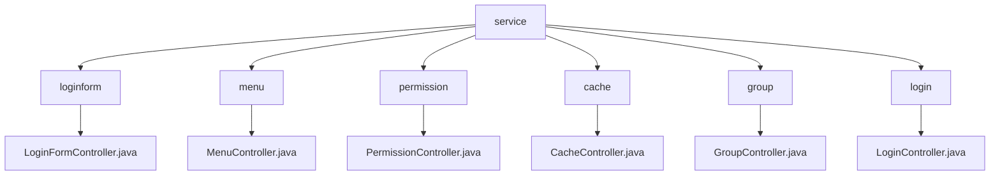

# 基础信息

|      |      |
|------|------|
| 名称 | service |
| 编码语言 | .java |
| 代码路径 | erp-backend/erp-core/src/main/java/com/jukusoft/erp/core/module/base/service |
| 包名 | erp-backend.erp-core.src.main.java.com.jukusoft.erp.core.module.base.service |
| 概述说明 | LoginFormController处理登录表单，MenuController验证并返回菜单，PermissionController管理用户权限，CacheController清除缓存，GroupController处理群组信息，登录控制器管理用户会话。 |

# 说明

## 概述
该代码模块是一个企业资源规划（ERP）系统的核心模块，主要涉及用户登录、权限管理、菜单管理、缓存管理和群组管理等功能。模块通过多个控制器类处理不同的业务场景，确保系统的安全性、数据的准确性和用户体验的优化。

## 主要业务场景
1. **用户登录与身份验证**：
   - `LoginFormController` 负责生成登录表单，处理用户输入的用户名和密码，提供用户与系统交互的界面。
   - `登录控制器` 处理用户的登录、登出及登录状态检查，通过验证用户输入的用户名和密码来确认身份，并管理用户的会话状态，确保用户身份验证的安全性。

2. **权限管理**：
   - `PermissionController` 提供 `listPermissions` 方法，用于获取用户的权限信息，确保权限控制的准确性和及时性。

3. **菜单管理**：
   - `MenuController` 处理菜单列表的请求，首先进行权限验证，确保用户具备访问权限，然后筛选并返回符合条件的菜单项，确保菜单列表的安全性和准确性。

4. **缓存管理**：
   - `CacheController` 负责提供清除缓存的功能，在执行清除操作之前进行权限验证，确保操作的安全性，并返回被清除缓存项的列表，有助于管理系统缓存，确保数据的及时更新和系统性能的优化。

5. **群组管理**：
   - `GroupController` 处理用户群组列表及相关ID查询，返回详细的群组信息以及对应的ID数组，确保用户能够准确获取所需群组数据，便于后续操作和管理。

### 包内部结构视图

该流程图展示了ERP后端核心模块中基础服务的层级结构。`service`作为根节点，包含了多个子服务模块，如`loginform`、`menu`、`permission`等。每个子服务模块下又包含对应的控制器文件，如`LoginFormController.java`、`MenuController.java`等。整体结构清晰，反映了服务的组织方式和文件之间的依赖关系。

# 文件列表 File List

| 名称   | 类型  | 说明 |
|-------|------|-------------|
| [permission](permission/_module.md) | package | PermissionController类的listPermissions方法获取用户权限并返回响应。 |
| [cache](cache/_module.md) | package | CacheController类提供清除缓存功能，需权限验证，返回清除列表。 |
| [login](login/_module.md) | package | 登录控制器负责用户登录、登出及状态检查，验证凭据并管理会话。 |
| [group](group/_module.md) | package | GroupController管理用户群组列表及ID查询，返回群组信息和ID数组。 |
| [menu](menu/_module.md) | package | MenuController验证权限并返回符合条件的菜单项。 |
| [loginform](loginform/_module.md) | package | LoginFormController生成含用户名和密码输入框的HTML登录表单。 |

