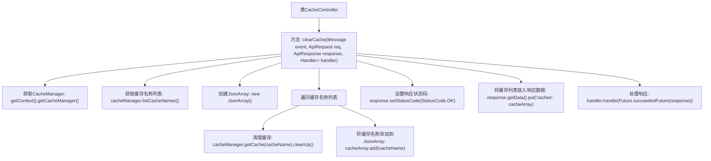

# 基础信息

|      |      |
|------|------|
| 名称 | CacheController |
| 编码语言 | .java |
| 代码路径 | erp-backend/erp-core/src/main/java/com/jukusoft/erp/core/module/base/service/cache/CacheController.java |
| 包名 | com.jukusoft.erp.core.module.base.service.cache |
| 依赖项 | ['com.jukusoft.erp.lib.annotation.PermissionRequired', 'com.jukusoft.erp.lib.cache.CacheManager', 'com.jukusoft.erp.lib.message.StatusCode', 'com.jukusoft.erp.lib.message.request.ApiRequest', 'com.jukusoft.erp.lib.message.response.ApiResponse', 'com.jukusoft.erp.lib.route.Route', 'com.jukusoft.erp.lib.controller.AbstractController', 'io.vertx.core.AsyncResult', 'io.vertx.core.Future', 'io.vertx.core.Handler', 'io.vertx.core.eventbus.Message', 'io.vertx.core.json.JsonArray', 'java.util.List'] |
| 概述说明 | CacheController类提供清除缓存功能，需权限验证，返回清除列表。 |

# 说明

CacheController类负责提供清除缓存的功能。在执行清除操作之前，必须进行权限验证以确保操作的安全性。成功清除缓存后，该类会返回一个包含被清除缓存项的列表，以便用户或系统能够了解哪些缓存已被移除。这一功能有助于管理系统缓存，确保数据的及时更新和系统性能的优化。

# 类列表 Class Summary

| 名称   | 类型  | 说明 |
|-------|------|-------------|
| CacheController | class | CacheController类提供清除缓存功能，需权限验证，返回清除的缓存列表。 |


## 类 CacheController

|      |      |
|------|------|
| 访问范围 | public |
| 类型 | class |
| 名称 | CacheController |
| 说明 | CacheController类提供清除缓存功能，需权限验证，返回清除的缓存列表。 |


### UML类图

```mermaid
classDiagram
    class AbstractController {
        +CacheManager getContext()
    }
    class CacheController {
        +void clearCache(Message~ApiRequest~ event, ApiRequest req, ApiResponse response, Handler~AsyncResult~ApiResponse~~ handler)
    }
    class CacheManager {
        +List~String~ listCacheNames()
        +Cache getCache(String cacheName)
    }
    class Cache {
        +void cleanUp()
    }
    class ApiRequest {
    }
    class ApiResponse {
        +void setStatusCode(StatusCode statusCode)
        +Map~String, Object~ getData()
    }
    class Message~T~ {
    }
    class Handler~T~ {
        +void handle(T result)
    }
    class AsyncResult~T~ {
    }
    class JsonArray {
        +void add(String value)
    }
    class StatusCode {
        +static final StatusCode OK
    }

    AbstractController <|-- CacheController
    CacheController --> CacheManager : 依赖
    CacheController --> ApiRequest : 依赖
    CacheController --> ApiResponse : 依赖
    CacheController --> Handler~AsyncResult~ApiResponse~~ : 依赖
    CacheManager --> Cache : 依赖
    CacheController --> JsonArray : 依赖
    ApiResponse --> StatusCode : 依赖
```

这段代码定义了一个`CacheController`类，继承自`AbstractController`，用于处理缓存清理请求。`clearCache`方法接收消息、请求、响应和处理器作为参数，通过`CacheManager`获取所有缓存名称并逐个清理，最后将清理的缓存名称添加到响应中并返回。类图展示了各个类之间的关系和依赖，包括`CacheManager`、`Cache`、`ApiRequest`、`ApiResponse`等。


### 内部方法调用关系图



这段代码描述了一个`CacheController`类中的`clearCache`方法，该方法用于清理所有缓存。首先，它获取`CacheManager`实例，然后列出所有缓存名称并遍历这些名称，逐个清理缓存。清理过程中，缓存名称被添加到`JsonArray`中。最后，设置响应状态码为`OK`，并将清理的缓存列表放入响应数据中，最终通过`handler`处理响应。

### 字段列表 Field List

| 名称  | 类型  | 说明 |
|-------|-------|------|

### 方法列表 Method List

| 名称  | 类型  | 说明 |
|-------|-------|------|
| clearCache | void | 清除缓存方法，需权限，遍历并清理所有缓存，返回状态码及缓存列表。 |


