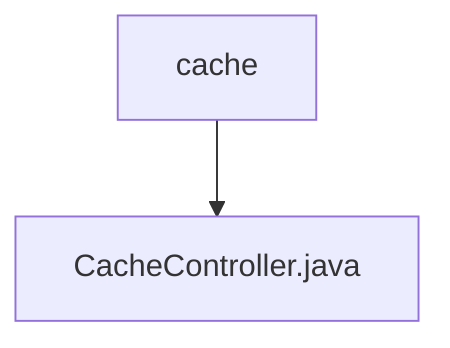

# 基础信息

|      |      |
|------|------|
| 名称 | cache |
| 编码语言 | .java |
| 代码路径 | erp-backend/erp-core/src/main/java/com/jukusoft/erp/core/module/base/service/cache |
| 包名 | erp-backend.erp-core.src.main.java.com.jukusoft.erp.core.module.base.service.cache |
| 概述说明 | CacheController类提供清除缓存功能，需权限验证，返回清除列表。 |

# 说明

CacheController类负责提供清除缓存的功能。在执行清除操作之前，必须进行权限验证以确保操作的安全性。成功清除缓存后，该类会返回一个包含被清除缓存项的列表，以便用户或系统能够了解哪些缓存已被移除。这一功能有助于管理系统缓存，确保数据的及时更新和系统性能的优化。

### 包内部结构视图

该流程图展示了路径的层级关系，`cache` 文件夹包含一个名为 `CacheController.java` 的文件。通过简洁的图形表示，清晰地展示了文件与文件夹之间的从属关系。

# 文件列表 File List

| 名称   | 类型  | 说明 |
|-------|------|-------------|
| [CacheController.java](CacheController.md) | file | CacheController类提供清除缓存功能，需权限验证，返回清除列表。 |

