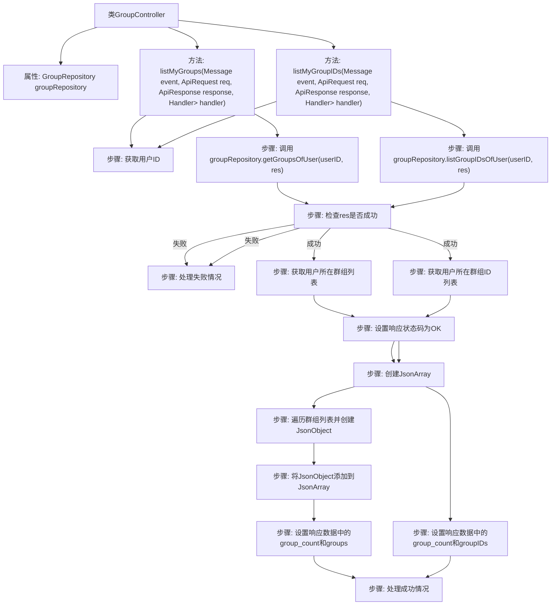

# 基础信息

|      |      |
|------|------|
| 名称 | GroupController |
| 编码语言 | .java |
| 代码路径 | erp-backend/erp-core/src/main/java/com/jukusoft/erp/core/module/base/service/group/GroupController.java |
| 包名 | com.jukusoft.erp.core.module.base.service.group |
| 依赖项 | ['com.jukusoft.data.entity.GroupMember', 'com.jukusoft.data.repository.GroupRepository', 'com.jukusoft.erp.lib.database.InjectRepository', 'com.jukusoft.erp.lib.message.StatusCode', 'com.jukusoft.erp.lib.message.request.ApiRequest', 'com.jukusoft.erp.lib.message.response.ApiResponse', 'com.jukusoft.erp.lib.route.Route', 'com.jukusoft.erp.lib.controller.AbstractController', 'io.vertx.core.AsyncResult', 'io.vertx.core.Future', 'io.vertx.core.Handler', 'io.vertx.core.eventbus.Message', 'io.vertx.core.json.JsonArray', 'io.vertx.core.json.JsonObject', 'java.util.List'] |
| 概述说明 | GroupController管理用户群组列表及ID查询，返回群组信息和ID数组。 |

# 说明

GroupController负责处理用户群组列表及相关ID查询，能够返回详细的群组信息以及对应的ID数组。该控制器功能全面，确保用户能够准确获取所需群组数据，便于后续操作和管理。

# 类列表 Class Summary

| 名称   | 类型  | 说明 |
|-------|------|-------------|
| GroupController | class | GroupController处理用户群组列表及ID查询，返回群组信息和ID数组。 |


## 类 GroupController

|      |      |
|------|------|
| 访问范围 | public |
| 类型 | class |
| 名称 | GroupController |
| 说明 | GroupController处理用户群组列表及ID查询，返回群组信息和ID数组。 |


### UML类图

```mermaid
classDiagram
    class AbstractController {
        <<Abstract>>
    }

    class GroupController {
        -GroupRepository groupRepository
        +listMyGroups(Message~ApiRequest~ event, ApiRequest req, ApiResponse response, Handler~AsyncResult~ApiResponse~~ handler) void
        +listMyGroupIDs(Message~ApiRequest~ event, ApiRequest req, ApiResponse response, Handler~AsyncResult~ApiResponse~~ handler) void
    }

    class GroupRepository {
        <<Interface>>
        +getGroupsOfUser(long userID, Handler~AsyncResult~List~GroupMember~~~ handler) void
        +listGroupIDsOfUser(long userID, Handler~AsyncResult~long[]~ handler) void
    }

    class Message~T~ {
        <<Interface>>
    }

    class ApiRequest {
        +long getUserID() long
    }

    class ApiResponse {
        -int statusCode
        -JsonObject data
        +void setStatusCode(int statusCode)
        +JsonObject getData() JsonObject
    }

    class Handler~T~ {
        <<Interface>>
        +void handle(T result)
    }

    class AsyncResult~T~ {
        <<Interface>>
    }

    class GroupMember {
        +Group getGroup() Group
        +boolean isOwner() boolean
        +boolean isMainGroup() boolean
    }

    class Group {
        +long getGroupID() long
        +String getName() String
        +String getDescription() String
        +String getColorHex() String
        +boolean isActivated() boolean
    }

    class JsonArray {
        +void add(Object value)
    }

    class JsonObject {
        +void put(String key, Object value)
    }

    AbstractController <|-- GroupController
    GroupController --> GroupRepository : 依赖
    GroupController --> Message~ApiRequest~ : 依赖
    GroupController --> ApiRequest : 依赖
    GroupController --> ApiResponse : 依赖
    GroupController --> Handler~AsyncResult~ApiResponse~~ : 依赖
    GroupRepository --> Handler~AsyncResult~List~GroupMember~~~ : 依赖
    GroupRepository --> Handler~AsyncResult~long[]~ : 依赖
    GroupMember --> Group : 依赖
```

**描述：**  
`GroupController` 继承自 `AbstractController`，负责处理与用户组相关的请求。它依赖于 `GroupRepository` 接口来获取用户组信息，并通过 `listMyGroups` 和 `listMyGroupIDs` 方法分别返回用户所属的组列表和组ID列表。`GroupController` 还依赖于 `Message`、`ApiRequest`、`ApiResponse` 和 `Handler` 等接口来处理请求和响应。`GroupMember` 和 `Group` 类用于表示用户组成员和组信息，`JsonArray` 和 `JsonObject` 用于构建响应数据。


### 内部方法调用关系图



这段代码展示了一个`GroupController`类，它包含两个主要方法：`listMyGroups`和`listMyGroupIDs`。这两个方法分别用于获取用户所在群组的详细信息和群组ID列表。代码通过调用`GroupRepository`的方法来获取数据，并根据结果设置响应状态码和数据。流程图清晰地展示了每个方法的执行步骤，包括数据获取、错误处理和响应数据的构建。

### 字段列表 Field List

| 名称  | 类型  | 说明 |
|-------|-------|------|
| groupRepository | GroupRepository | 注入GroupRepository以进行组数据操作。 |

### 方法列表 Method List

| 名称  | 类型  | 说明 |
|-------|-------|------|
| listMyGroups | void | 获取用户ID并查询其所属群组，返回群组信息列表。 |
| listMyGroupIDs | void | 获取用户ID，查询用户所属群组ID列表，返回成功状态及群组信息。 |


