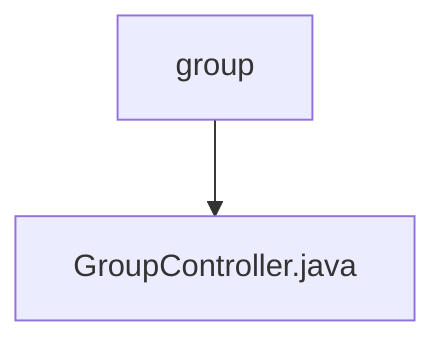

# 基础信息

|      |      |
|------|------|
| 名称 | group |
| 编码语言 | .java |
| 代码路径 | erp-backend/erp-core/src/main/java/com/jukusoft/erp/core/module/base/service/group |
| 包名 | erp-backend.erp-core.src.main.java.com.jukusoft.erp.core.module.base.service.group |
| 概述说明 | GroupController管理用户群组列表及ID查询，返回群组信息和ID数组。 |

# 说明

GroupController负责处理用户群组列表及相关ID查询，能够返回详细的群组信息以及对应的ID数组。该控制器功能全面，确保用户能够准确获取所需群组数据，便于后续操作和管理。

### 包内部结构视图

该流程图展示了路径的层级关系，`group` 是父节点，`GroupController.java` 是其子节点。路径结构清晰，反映了文件在项目中的具体位置，帮助开发者快速理解项目的目录结构。

# 文件列表 File List

| 名称   | 类型  | 说明 |
|-------|------|-------------|
| [GroupController.java](GroupController.md) | file | GroupController管理用户群组列表及ID查询，返回群组信息和ID数组。 |

