# 基础信息

|      |      |
|------|------|
| 名称 | LoginController |
| 编码语言 | .java |
| 代码路径 | erp-backend/erp-core/src/main/java/com/jukusoft/erp/core/module/base/service/login/LoginController.java |
| 包名 | com.jukusoft.erp.core.module.base.service.login |
| 依赖项 | ['com.jukusoft.data.entity.User', 'com.jukusoft.data.repository.UserRepository', 'com.jukusoft.erp.lib.database.InjectRepository', 'com.jukusoft.erp.lib.message.StatusCode', 'com.jukusoft.erp.lib.message.request.ApiRequest', 'com.jukusoft.erp.lib.message.response.ApiResponse', 'com.jukusoft.erp.lib.route.Route', 'com.jukusoft.erp.lib.controller.AbstractController', 'com.jukusoft.erp.lib.session.Session', 'io.vertx.core.AsyncResult', 'io.vertx.core.Future', 'io.vertx.core.Handler', 'io.vertx.core.eventbus.Message'] |
| 概述说明 | 登录控制器负责用户登录、登出及状态检查，验证凭据并管理会话。 |

# 说明

登录控制器负责处理用户的登录、登出及登录状态检查功能。它通过验证用户输入的用户名和密码来确认身份，并管理用户的会话状态，确保用户在登录后保持有效的会话，以及在登出时清除会话信息。该控制器确保用户身份验证的安全性，并提供对登录状态的实时检查，以维护系统的安全性和用户体验。

# 类列表 Class Summary

| 名称   | 类型  | 说明 |
|-------|------|-------------|
| LoginController | class | 登录控制器处理用户登录、登出及登录状态检查，验证用户名密码，管理会话状态。 |


## 类 LoginController

|      |      |
|------|------|
| 访问范围 | public |
| 类型 | class |
| 名称 | LoginController |
| 说明 | 登录控制器处理用户登录、登出及登录状态检查，验证用户名密码，管理会话状态。 |


### UML类图

```mermaid
classDiagram
    class AbstractController {
        <<Abstract>>
    }

    class LoginController {
        -UserRepository userRepository
        +tryLogin(Message~ApiRequest~ event, ApiRequest req, ApiResponse response, Handler~AsyncResult~ApiResponse~~ handler) void
        +isLoggedIn(Message~ApiRequest~ event, ApiRequest req, ApiResponse response, Handler~AsyncResult~ApiResponse~~ handler) void
        +logout(Message~ApiRequest~ event, ApiRequest req, ApiResponse response, Handler~AsyncResult~ApiResponse~~ handler) void
        #generateFailedMessage(String message, ApiResponse response) void
        #generateSuccessMessage(String message, long userID, String username, ApiResponse response) void
    }

    class UserRepository {
        <<Interface>>
        +getUserByUsername(String username, Handler~AsyncResult~User~~ handler) void
        +checkPassword(long userID, String password, Handler~AsyncResult~Boolean~~ handler) void
    }

    class ApiRequest {
        +getData() Map
        +getMessageID() String
        +getIP() String
        +getSessionID() String
    }

    class ApiResponse {
        +setStatusCode(StatusCode statusCode) void
        +getData() Map
    }

    class Session {
        +login(long userID, String username) void
        +logout() void
        +flush() void
        +isLoggedIn() boolean
        +getUserID() long
        +getUsername() String
    }

    class StatusCode {
        <<Enum>>
        BAD_REQUEST
        OK
    }

    class Message~T~ {
        <<Interface>>
    }

    class Handler~T~ {
        <<Interface>>
        +handle(T result) void
    }

    class AsyncResult~T~ {
        <<Interface>>
        +succeeded() boolean
        +result() T
        +cause() Throwable
    }

    class User {
        +getUserID() long
        +getUsername() String
    }

    AbstractController <|-- LoginController
    LoginController --> UserRepository : 依赖
    LoginController --> ApiRequest : 依赖
    LoginController --> ApiResponse : 依赖
    LoginController --> Session : 依赖
    LoginController --> StatusCode : 依赖
    LoginController --> Message~ApiRequest~ : 依赖
    LoginController --> Handler~AsyncResult~ApiResponse~~ : 依赖
    UserRepository --> User : 依赖
    UserRepository --> Handler~AsyncResult~User~~ : 依赖
    UserRepository --> Handler~AsyncResult~Boolean~~ : 依赖
    Session --> Handler~AsyncResult~ApiResponse~~ : 依赖
    AsyncResult~T~ --> Handler~T~ : 依赖
```

这段代码定义了一个 `LoginController` 类，继承自 `AbstractController`，用于处理用户登录、登出和检查登录状态的请求。`LoginController` 依赖于 `UserRepository` 来获取用户信息和验证密码，并通过 `Session` 管理用户会话。代码中使用了 `ApiRequest` 和 `ApiResponse` 来处理请求和响应，并通过 `Handler` 和 `AsyncResult` 处理异步操作。`generateFailedMessage` 和 `generateSuccessMessage` 方法用于生成登录成功或失败的响应消息。


### 内部方法调用关系图

```mermaid
graph TD
    A["类LoginController"]
    B["属性: UserRepository userRepository"]
    C["方法: tryLogin(Message<ApiRequest> event, ApiRequest req, ApiResponse response, Handler<AsyncResult<ApiResponse>> handler)"]
    D["方法: isLoggedIn(Message<ApiRequest> event, ApiRequest req, ApiResponse response, Handler<AsyncResult<ApiResponse>> handler)"]
    E["方法: logout(Message<ApiRequest> event, ApiRequest req, ApiResponse response, Handler<AsyncResult<ApiResponse>> handler)"]
    F["方法: generateFailedMessage(String message, ApiResponse response)"]
    G["方法: generateSuccessMessage(String message, long userID, String username, ApiResponse response)"]
    H["步骤: 'validate username'"]
    I["步骤: 'get username'"]
    J["步骤: 'get password'"]
    K["步骤: 'find user by username'"]
    L["步骤: 'check password'"]
    M["步骤: 'get session'"]
    N["步骤: 'set logged in state'"]
    O["步骤: 'save session'"]
    P["步骤: 'reset user id and username'"]
    Q["步骤: 'save session'"]
    R["步骤: 'handle response'"]

    A --> B
    A --> C
    A --> D
    A --> E
    A --> F
    A --> G
    C --> H
    C --> I
    C --> J
    C --> K
    C --> L
    C --> M
    C --> N
    C --> O
    C --> R
    D --> M
    D --> R
    E --> M
    E --> P
    E --> Q
    E --> R
    F --> R
    G --> R
```



这段代码描述了一个`LoginController`类，它负责处理用户登录、登出以及检查用户登录状态的逻辑。`tryLogin`方法首先验证用户名和密码，然后通过`userRepository`查找用户并验证密码。如果验证成功，用户会话会被更新并保存。`isLoggedIn`方法检查用户是否已登录，并返回登录状态。`logout`方法处理用户登出逻辑，重置会话信息并保存。`generateFailedMessage`和`generateSuccessMessage`方法用于生成登录失败或成功的响应消息。

### 字段列表 Field List

| 名称  | 类型  | 说明 |
|-------|-------|------|
| userRepository | UserRepository | 注入UserRepository实例以供使用。 |

### 方法列表 Method List

| 名称  | 类型  | 说明 |
|-------|-------|------|
| generateSuccessMessage | void | 生成成功消息并设置响应数据。 |
| isLoggedIn | void | 检查用户登录状态并返回用户ID和用户名。 |
| generateFailedMessage | void | 生成失败消息，设置状态码为OK，并记录登录状态和消息。 |
| tryLogin | void | 验证用户登录信息，检查用户名和密码，返回登录结果。 |
| logout | void | 注销用户会话，设置状态码为OK，记录日志并重置用户信息。 |


