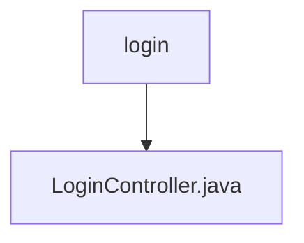

# 基础信息

|      |      |
|------|------|
| 名称 | login |
| 编码语言 | .java |
| 代码路径 | erp-backend/erp-core/src/main/java/com/jukusoft/erp/core/module/base/service/login |
| 包名 | erp-backend.erp-core.src.main.java.com.jukusoft.erp.core.module.base.service.login |
| 概述说明 | 登录控制器负责用户登录、登出及状态检查，验证凭据并管理会话。 |

# 说明

登录控制器负责处理用户的登录、登出及登录状态检查功能。它通过验证用户输入的用户名和密码来确认身份，并管理用户的会话状态，确保用户在登录后保持有效的会话，以及在登出时清除会话信息。该控制器确保用户身份验证的安全性，并提供对登录状态的实时检查，以维护系统的安全性和用户体验。

### 包内部结构视图

该流程图展示了`login`文件夹与`LoginController.java`文件之间的层级关系。`login`作为父节点，包含了一个子节点`LoginController.java`，表示该文件位于`login`文件夹内。这种结构清晰地反映了文件在项目中的位置和归属关系。

# 文件列表 File List

| 名称   | 类型  | 说明 |
|-------|------|-------------|
| [LoginController.java](LoginController.md) | file | 登录控制器负责用户登录、登出及状态检查，验证凭据并管理会话。 |

