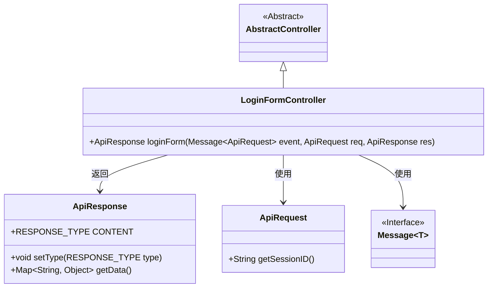
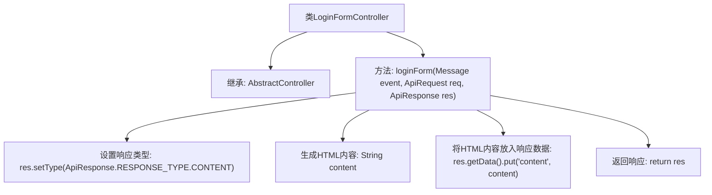

# 基础信息

|      |      |
|------|------|
| 名称 | LoginFormController |
| 编码语言 | .java |
| 代码路径 | erp-backend/erp-core/src/main/java/com/jukusoft/erp/core/module/base/service/loginform/LoginFormController.java |
| 包名 | com.jukusoft.erp.core.module.base.service.loginform |
| 依赖项 | ['com.jukusoft.erp.lib.message.request.ApiRequest', 'com.jukusoft.erp.lib.message.response.ApiResponse', 'com.jukusoft.erp.lib.route.Route', 'com.jukusoft.erp.lib.controller.AbstractController', 'io.vertx.core.eventbus.Message'] |
| 概述说明 | LoginFormController生成含用户名和密码输入框的HTML登录表单。 |

# 说明

LoginFormController负责处理登录表单请求，其主要功能是生成一个包含用户名和密码输入框的HTML表单。该控制器确保用户能够通过表单输入必要的登录信息，以便进行身份验证。通过这种方式，LoginFormController在用户登录过程中起到了关键作用，提供了用户与系统交互的界面。

# 类列表 Class Summary

| 名称   | 类型  | 说明 |
|-------|------|-------------|
| LoginFormController | class | LoginFormController处理登录表单请求，生成包含用户名和密码输入框的HTML表单。 |

## 类 LoginFormController

|      |      |
|------|------|
| 访问范围 | public |
| 类型 | class |
| 名称 | LoginFormController |
| 说明 | LoginFormController处理登录表单请求，生成包含用户名和密码输入框的HTML表单。 |

### UML类图

这段代码定义了一个`LoginFormController`类，它继承自`AbstractController`类。`LoginFormController`类中的`loginForm`方法处理登录表单的生成，并返回一个包含HTML内容的`ApiResponse`对象。`ApiResponse`类用于设置响应类型和存储数据，`ApiRequest`类用于获取会话ID，`Message`接口用于传递请求事件。整个流程展示了从接收请求到生成响应的过程。

### 内部方法调用关系图

这段代码描述了一个`LoginFormController`类，该类继承自`AbstractController`。`loginForm`方法处理登录表单的请求，设置响应类型为`CONTENT`，并生成一个包含用户名和密码输入框的HTML表单。生成的HTML内容被放入响应数据中，并最终返回该响应。该流程展示了从请求处理到响应生成的全过程。

### 字段列表 Field List

| 名称  | 类型  | 说明 |
|-------|-------|------|

### 方法列表 Method List

| 名称  | 类型  | 说明 |
|-------|-------|------|
| loginForm | ApiResponse | 生成登录表单，包含用户名、密码输入框及提交按钮。 |

