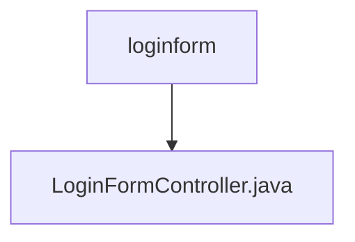

# 基础信息

|      |      |
|------|------|
| 名称 | loginform |
| 编码语言 | .java |
| 代码路径 | erp-backend/erp-core/src/main/java/com/jukusoft/erp/core/module/base/service/loginform |
| 包名 | erp-backend.erp-core.src.main.java.com.jukusoft.erp.core.module.base.service.loginform |
| 概述说明 | LoginFormController生成含用户名和密码输入框的HTML登录表单。 |

# 说明

LoginFormController负责处理登录表单请求，其主要功能是生成一个包含用户名和密码输入框的HTML表单。该控制器确保用户能够通过表单输入必要的登录信息，以便进行身份验证。通过这种方式，LoginFormController在用户登录过程中起到了关键作用，提供了用户与系统交互的界面。

### 包内部结构视图

该流程图展示了`loginform`文件夹与其内部文件`LoginFormController.java`之间的层级关系。`loginform`作为父节点，包含了一个子节点`LoginFormController.java`，表示该文件位于`loginform`文件夹内。这种结构清晰地反映了文件在项目中的位置关系。

# 文件列表 File List

| 名称   | 类型  | 说明 |
|-------|------|-------------|
| [LoginFormController.java](LoginFormController.md) | file | LoginFormController生成含用户名和密码输入框的HTML登录表单。 |

