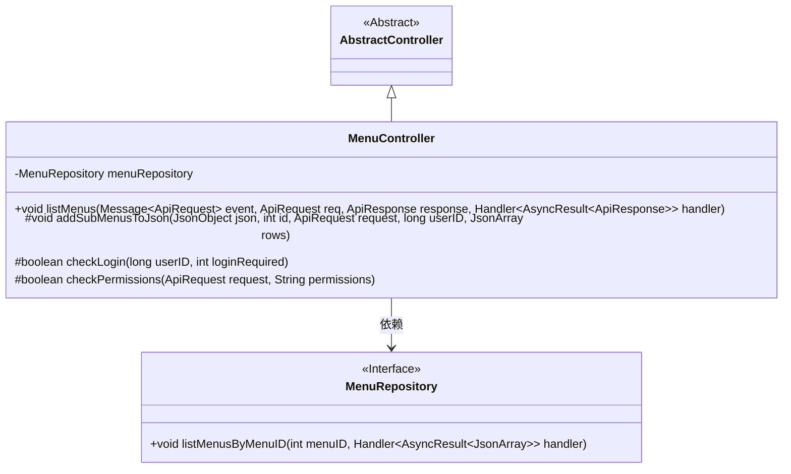
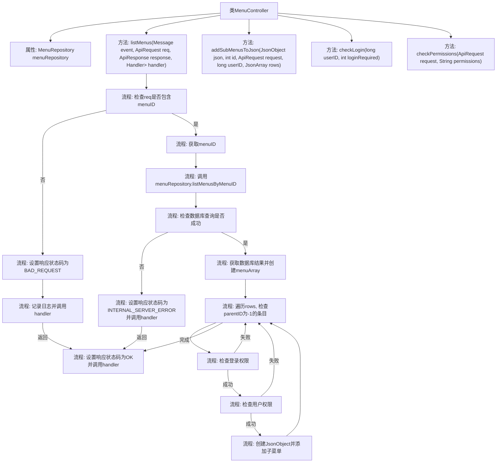

# 基础信息

|      |      |
|------|------|
| 名称 | MenuController |
| 编码语言 | .java |
| 代码路径 | erp-backend/erp-core/src/main/java/com/jukusoft/erp/core/module/base/service/menu/MenuController.java |
| 包名 | com.jukusoft.erp.core.module.base.service.menu |
| 依赖项 | ['com.jukusoft.data.repository.MenuRepository', 'com.jukusoft.erp.lib.database.InjectRepository', 'com.jukusoft.erp.lib.message.StatusCode', 'com.jukusoft.erp.lib.message.request.ApiRequest', 'com.jukusoft.erp.lib.message.response.ApiResponse', 'com.jukusoft.erp.lib.route.Route', 'com.jukusoft.erp.lib.controller.AbstractController', 'io.vertx.core.AsyncResult', 'io.vertx.core.Future', 'io.vertx.core.Handler', 'io.vertx.core.eventbus.Message', 'io.vertx.core.json.JsonArray', 'io.vertx.core.json.JsonObject', 'io.vertx.ext.sync.Sync'] |
| 概述说明 | MenuController验证权限并返回符合条件的菜单项。 |

# 说明

MenuController负责处理菜单列表的请求，首先进行权限验证，确保用户具备访问权限，然后筛选并返回符合条件的菜单项。该控制器确保菜单列表的安全性和准确性，仅向有权限的用户展示相关菜单项。

# 类列表 Class Summary

| 名称   | 类型  | 说明 |
|-------|------|-------------|
| MenuController | class | MenuController处理菜单列表请求，验证权限并返回符合条件的菜单项。 |

## 类 MenuController

|      |      |
|------|------|
| 访问范围 | public |
| 类型 | class |
| 名称 | MenuController |
| 说明 | MenuController处理菜单列表请求，验证权限并返回符合条件的菜单项。 |

### UML类图

这段代码展示了一个 `MenuController` 类，它继承自 `AbstractController`，并依赖于 `MenuRepository` 接口。`MenuController` 的主要功能是通过 `listMenus` 方法处理菜单列表请求，检查请求中的 `menuID`，从数据库中获取菜单数据，并根据用户权限和登录状态过滤菜单项。`addSubMenusToJson` 方法用于递归地添加子菜单项，`checkLogin` 和 `checkPermissions` 方法分别用于检查用户登录状态和权限。整个过程涉及复杂的逻辑处理和异步操作。

### 内部方法调用关系图

这段代码描述了一个`MenuController`类，用于处理菜单列表请求。首先，它检查请求中是否包含`menuID`，如果不包含则返回错误响应。如果包含，则从数据库中获取菜单列表，并检查每个菜单项的登录权限和用户权限。如果权限检查通过，则将菜单项添加到响应中，并递归处理子菜单。最后，返回包含菜单列表的响应。

### 字段列表 Field List

| 名称  | 类型  | 说明 |
|-------|-------|------|
| menuRepository | MenuRepository | 注入MenuRepository实例用于数据操作。 |

### 方法列表 Method List

| 名称  | 类型  | 说明 |
|-------|-------|------|
| checkPermissions | boolean | 检查API请求权限，若权限为空或满足任一权限则返回真。 |
| listMenus | void | 检查请求是否包含menuID，查询数据库获取菜单列表，验证登录和权限，返回符合条件的菜单数据。 |
| checkLogin | boolean | 检查用户登录状态，满足条件返回true，否则false。 |
| addSubMenusToJson | void | 方法将符合条件的子菜单加入JSON，检查登录和权限，递归添加子菜单。 |

