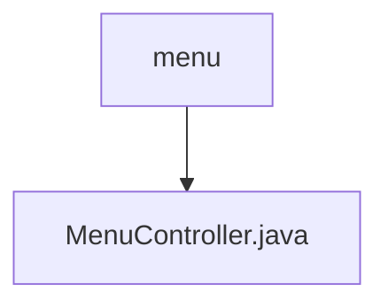

# 基础信息

|      |      |
|------|------|
| 名称 | menu |
| 编码语言 | .java |
| 代码路径 | erp-backend/erp-core/src/main/java/com/jukusoft/erp/core/module/base/service/menu |
| 包名 | erp-backend.erp-core.src.main.java.com.jukusoft.erp.core.module.base.service.menu |
| 概述说明 | MenuController验证权限并返回符合条件的菜单项。 |

# 说明

MenuController负责处理菜单列表的请求，首先进行权限验证，确保用户具备访问权限，然后筛选并返回符合条件的菜单项。该控制器确保菜单列表的安全性和准确性，仅向有权限的用户展示相关菜单项。

### 包内部结构视图

该流程图展示了路径层级关系，`menu`文件夹下包含一个文件`MenuController.java`。这种结构通常用于组织和管理与菜单相关的服务和控制逻辑，确保代码的模块化和可维护性。

# 文件列表 File List

| 名称   | 类型  | 说明 |
|-------|------|-------------|
| [MenuController.java](MenuController.md) | file | MenuController验证权限并返回符合条件的菜单项。 |

