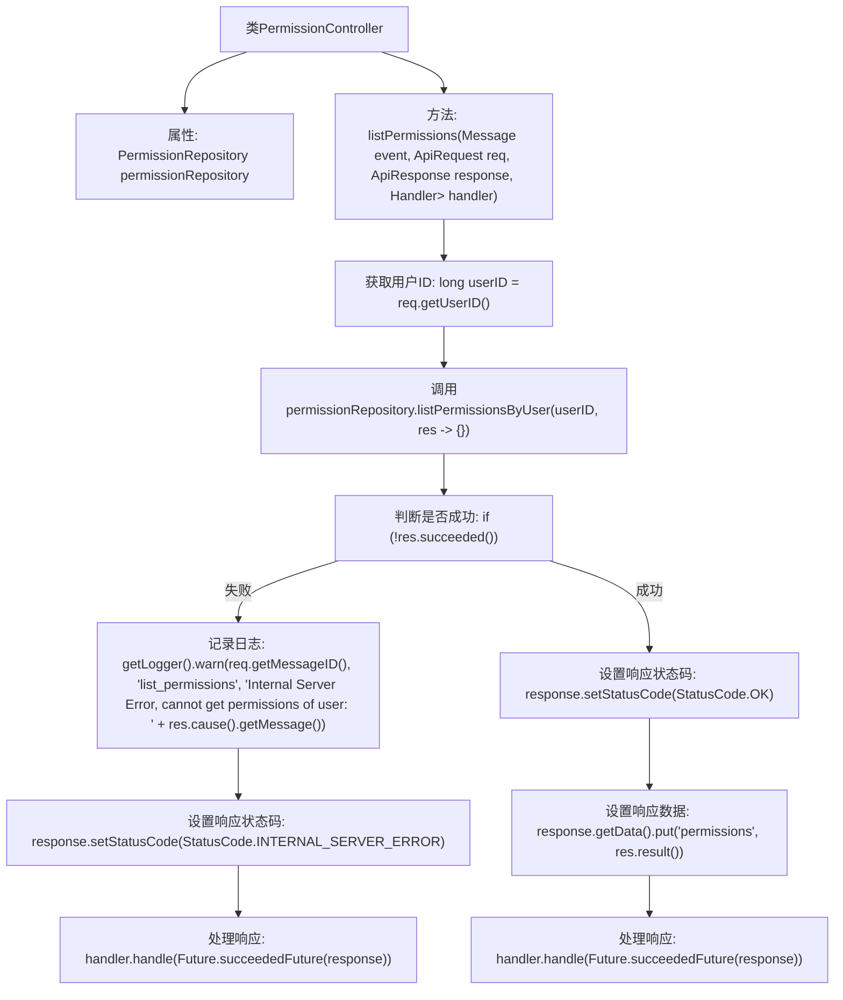

# 基础信息

|      |      |
|------|------|
| 名称 | PermissionController |
| 编码语言 | .java |
| 代码路径 | erp-backend/erp-core/src/main/java/com/jukusoft/erp/core/module/base/service/permission/PermissionController.java |
| 包名 | com.jukusoft.erp.core.module.base.service.permission |
| 依赖项 | ['com.jukusoft.data.repository.PermissionRepository', 'com.jukusoft.erp.lib.database.InjectRepository', 'com.jukusoft.erp.lib.message.StatusCode', 'com.jukusoft.erp.lib.message.request.ApiRequest', 'com.jukusoft.erp.lib.message.response.ApiResponse', 'com.jukusoft.erp.lib.route.Route', 'com.jukusoft.erp.lib.controller.AbstractController', 'io.vertx.core.AsyncResult', 'io.vertx.core.Future', 'io.vertx.core.Handler', 'io.vertx.core.eventbus.Message'] |
| 概述说明 | PermissionController类的listPermissions方法获取用户权限并返回响应。 |

# 说明

PermissionController类提供了一个名为listPermissions的方法，用于获取用户的权限信息。该方法执行后，会返回包含用户权限的响应数据。通过这一方法，系统能够有效地管理和查询用户的权限状态，确保权限控制的准确性和及时性。

# 类列表 Class Summary

| 名称   | 类型  | 说明 |
|-------|------|-------------|
| PermissionController | class | PermissionController类通过listPermissions方法获取用户权限并返回响应。 |


## 类 PermissionController

|      |      |
|------|------|
| 访问范围 | public |
| 类型 | class |
| 名称 | PermissionController |
| 说明 | PermissionController类通过listPermissions方法获取用户权限并返回响应。 |


### UML类图

```mermaid
classDiagram
    class AbstractController {
        <<Abstract>>
    }

    class PermissionController {
        -PermissionRepository permissionRepository
        +void listPermissions(Message~ApiRequest~ event, ApiRequest req, ApiResponse response, Handler~AsyncResult~ApiResponse~~ handler)
    }

    class PermissionRepository {
        <<Interface>>
        +void listPermissionsByUser(long userID, Handler~AsyncResult~List~Permission~~~ handler)
    }

    class ApiRequest {
        +long getUserID()
        +String getMessageID()
    }

    class ApiResponse {
        +void setStatusCode(StatusCode statusCode)
        +Map~String, Object~ getData()
    }

    class Message~T~ {
        <<Interface>>
    }

    class Handler~T~ {
        <<Interface>>
        +void handle(T result)
    }

    class AsyncResult~T~ {
        <<Interface>>
        +boolean succeeded()
        +Throwable cause()
        +T result()
    }

    class StatusCode {
        <<Enum>>
        +OK
        +INTERNAL_SERVER_ERROR
    }

    AbstractController <|-- PermissionController
    PermissionController --> PermissionRepository : 依赖
    PermissionController --> ApiRequest : 依赖
    PermissionController --> ApiResponse : 依赖
    PermissionController --> Handler~AsyncResult~ApiResponse~~ : 依赖
    PermissionRepository --> Handler~AsyncResult~List~Permission~~~ : 依赖
    ApiRequest --> Message~ApiRequest~ : 依赖
    ApiResponse --> StatusCode : 依赖
```

**描述：**  
`PermissionController` 继承自 `AbstractController`，负责处理权限相关的请求。它依赖于 `PermissionRepository` 接口来获取用户的权限列表，并通过 `ApiRequest` 和 `ApiResponse` 处理请求和响应。`Handler` 和 `AsyncResult` 用于异步处理结果，`StatusCode` 枚举表示响应状态码。整个流程展示了从获取用户ID到返回权限列表的完整过程。


### 内部方法调用关系图



这段代码展示了一个名为`PermissionController`的类，它继承了`AbstractController`。该类包含一个`listPermissions`方法，用于列出用户的权限。首先，它从请求中获取用户ID，然后调用`permissionRepository.listPermissionsByUser`方法获取用户的权限列表。如果获取失败，记录日志并返回500错误；如果成功，设置200状态码并将权限列表放入响应数据中，最终处理响应。

### 字段列表 Field List

| 名称  | 类型  | 说明 |
|-------|-------|------|
| permissionRepository | PermissionRepository | 注入权限仓库实例以访问权限数据。 |

### 方法列表 Method List

| 名称  | 类型  | 说明 |
|-------|-------|------|
| listPermissions | void | 获取用户权限列表，处理成功返回权限，失败记录错误并返回服务器错误状态。 |


