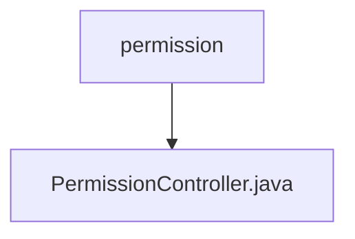

# 基础信息

|      |      |
|------|------|
| 名称 | permission |
| 编码语言 | .java |
| 代码路径 | erp-backend/erp-core/src/main/java/com/jukusoft/erp/core/module/base/service/permission |
| 包名 | erp-backend.erp-core.src.main.java.com.jukusoft.erp.core.module.base.service.permission |
| 概述说明 | PermissionController类的listPermissions方法获取用户权限并返回响应。 |

# 说明

PermissionController类提供了一个名为listPermissions的方法，用于获取用户的权限信息。该方法执行后，会返回包含用户权限的响应数据。通过这一方法，系统能够有效地管理和查询用户的权限状态，确保权限控制的准确性和及时性。

### 包内部结构视图

这段流程图展示了路径 `erp-backend/erp-core/src/main/java/com/jukusoft/erp/core/module/base/service/permission` 与其子文件 `PermissionController.java` 之间的层级关系。`permission` 是路径的最后一级文件夹，`PermissionController.java` 是该文件夹下的唯一文件。

# 文件列表 File List

| 名称   | 类型  | 说明 |
|-------|------|-------------|
| [PermissionController.java](PermissionController.md) | file | PermissionController类的listPermissions方法获取用户权限并返回响应。 |

