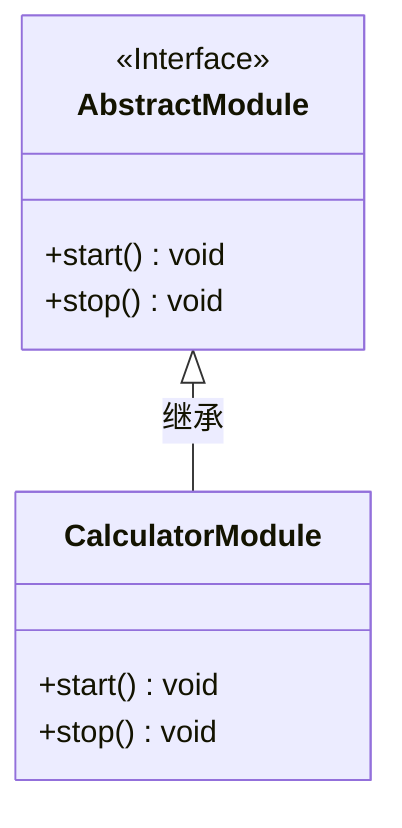
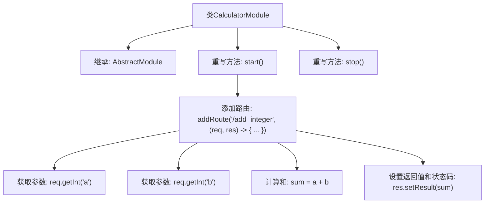

# 基础信息

|      |      |
|------|------|
| 名称 | CalculatorModule |
| 编码语言 | .java |
| 代码路径 | erp-backend/erp-core/src/main/java/com/jukusoft/erp/core/module/calculator/CalculatorModule.java |
| 包名 | com.jukusoft.erp.core.module.calculator |
| 依赖项 | ['com.jukusoft.erp.lib.message.StatusCode', 'com.jukusoft.erp.lib.module.AbstractModule'] |
| 概述说明 | CalculatorModule类提供加法API，通过/add_integer路径接收参数并返回和。 |

# 说明

CalculatorModule类实现了一个加法API，该API通过/add_integer路径接收参数，并返回这些参数的和。这个类的主要功能是处理加法运算，用户可以通过指定的路径提交整数参数，系统会计算并返回这些整数的总和。该API设计简洁，专注于实现加法功能，确保用户能够方便地获取计算结果。

# 类列表 Class Summary

| 名称   | 类型  | 说明 |
|-------|------|-------------|
| CalculatorModule | class | CalculatorModule类实现加法API，通过/add_integer路径接收参数并返回和。 |

## 类 CalculatorModule

|      |      |
|------|------|
| 访问范围 | public |
| 类型 | class |
| 名称 | CalculatorModule |
| 说明 | CalculatorModule类实现加法API，通过/add_integer路径接收参数并返回和。 |

### UML类图

这段代码展示了一个`CalculatorModule`类，它继承自`AbstractModule`接口。`CalculatorModule`类实现了`start`和`stop`方法，其中`start`方法用于添加一个路由，处理两个整数的加法运算，并将结果返回给客户端。`AbstractModule`接口定义了`start`和`stop`方法，`CalculatorModule`类通过实现这些方法来完成具体的业务逻辑。类图清晰地展示了`CalculatorModule`与`AbstractModule`之间的继承关系。

### 内部方法调用关系图

**描述：**  
`CalculatorModule`类继承自`AbstractModule`，并重写了`start()`和`stop()`方法。在`start()`方法中，通过`addRoute`方法添加了一个路由`/add_integer`，该路由处理两个整数参数`a`和`b`的加法运算，并将结果返回给客户端。整个流程包括获取参数、计算和、设置返回值和状态码。`stop()`方法为空，未实现具体功能。

### 字段列表 Field List

| 名称  | 类型  | 说明 |
|-------|-------|------|

### 方法列表 Method List

| 名称  | 类型  | 说明 |
|-------|-------|------|
| stop | void | 重写stop方法，不执行任何操作。 |
| start | void | 实现加法API，获取参数并计算和，返回结果和状态码200。 |

