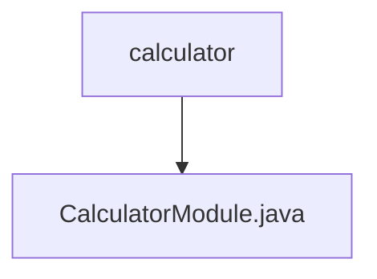

# 基础信息

|      |      |
|------|------|
| 名称 | calculator |
| 编码语言 | .java |
| 代码路径 | erp-backend/erp-core/src/main/java/com/jukusoft/erp/core/module/calculator |
| 包名 | erp-backend.erp-core.src.main.java.com.jukusoft.erp.core.module.calculator |
| 概述说明 | CalculatorModule类提供加法API，通过/add_integer路径接收参数并返回和。 |

# 说明

CalculatorModule类实现了一个加法API，该API通过/add_integer路径接收参数，并返回这些参数的和。这个类的主要功能是处理加法运算，用户可以通过指定的路径提交整数参数，系统会计算并返回这些整数的总和。该API设计简洁，专注于实现加法功能，确保用户能够方便地获取计算结果。

### 包内部结构视图

该流程图展示了`erp-backend/erp-core/src/main/java/com/jukusoft/erp/core/module/calculator`路径下的层级关系。`calculator`文件夹包含一个名为`CalculatorModule.java`的文件。流程图简洁明了，反映了路径的层级结构，便于理解项目中的文件组织方式。

# 文件列表 File List

| 名称   | 类型  | 说明 |
|-------|------|-------------|
| [CalculatorModule.java](CalculatorModule.md) | file | CalculatorModule类提供加法API，通过/add_integer路径接收参数并返回和。 |

