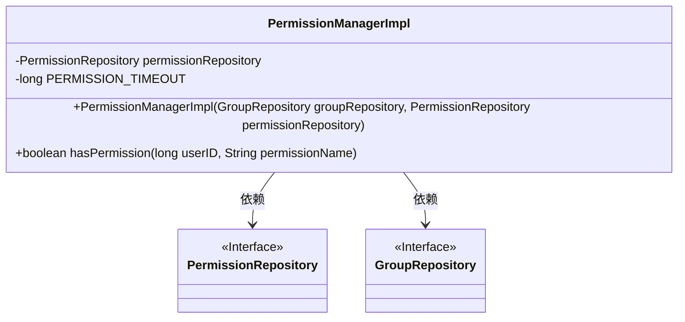
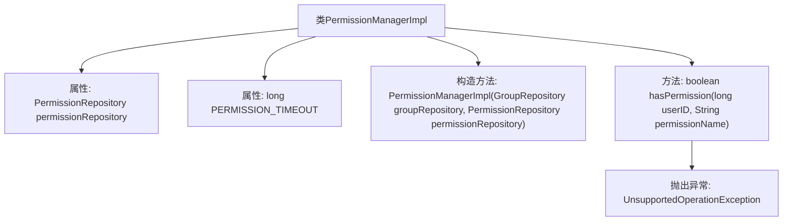

# 基础信息

|      |      |
|------|------|
| 名称 | PermissionManagerImpl |
| 编码语言 | .java |
| 代码路径 | erp-backend/erp-core/src/main/java/com/jukusoft/erp/core/permission/PermissionManagerImpl.java |
| 包名 | com.jukusoft.erp.core.permission |
| 依赖项 | ['com.jukusoft.data.repository.GroupRepository', 'com.jukusoft.data.repository.PermissionRepository', 'com.jukusoft.erp.lib.permission.PermissionManager', 'io.vertx.core.Future', 'io.vertx.ext.sync.Sync'] |
| 概述说明 | PermissionManagerImpl类管理权限，hasPermission方法已弃用。 |

# 说明

PermissionManagerImpl类负责权限管理功能，其中已弃用的hasPermission方法不再推荐使用。该方法原本用于检查用户是否具有特定权限，但由于其实现可能存在问题或已被更优的方法替代，建议开发者使用其他替代方案来进行权限验证。这一变更旨在提升系统的安全性和可维护性，确保权限管理更加高效和可靠。

# 类列表 Class Summary

| 名称   | 类型  | 说明 |
|-------|------|-------------|
| PermissionManagerImpl | class | PermissionManagerImpl类实现权限管理，已弃用hasPermission方法。 |

## 类 PermissionManagerImpl

|      |      |
|------|------|
| 访问范围 | public |
| 类型 | class |
| 名称 | PermissionManagerImpl |
| 说明 | PermissionManagerImpl类实现权限管理，已弃用hasPermission方法。 |

### UML类图

类图描述：  
`PermissionManagerImpl` 类实现了 `PermissionManager` 接口，并依赖于 `PermissionRepository` 和 `GroupRepository` 两个接口。`PermissionManagerImpl` 类包含一个 `permissionRepository` 成员变量和一个 `PERMISSION_TIMEOUT` 常量，并通过构造函数进行初始化。`hasPermission` 方法已被弃用，目前抛出 `UnsupportedOperationException` 异常。

### 内部方法调用关系图

这段代码定义了一个名为`PermissionManagerImpl`的类，该类实现了`PermissionManager`接口。类中包含两个属性：`permissionRepository`和`PERMISSION_TIMEOUT`。构造方法`PermissionManagerImpl`用于初始化`permissionRepository`。方法`hasPermission`被标记为`@Deprecated`，表示该方法已不再支持，并在调用时抛出`UnsupportedOperationException`异常。代码的结构简单，主要功能是管理权限，但`hasPermission`方法已弃用，不再提供实际功能。

### 字段列表 Field List

| 名称  | 类型  | 说明 |
|-------|-------|------|
| permissionRepository = null | PermissionRepository | 保护权限仓库实例为空。 |
| PERMISSION_TIMEOUT = 500 | long | 权限超时设置为500毫秒。 |

### 方法列表 Method List

| 名称  | 类型  | 说明 |
|-------|-------|------|
| hasPermission | boolean | 该方法已弃用，不再支持权限检查，直接抛出异常。 |

