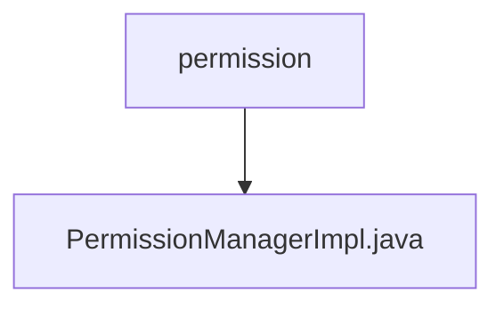

# 基础信息

|      |      |
|------|------|
| 名称 | permission |
| 编码语言 | .java |
| 代码路径 | erp-backend/erp-core/src/main/java/com/jukusoft/erp/core/permission |
| 包名 | erp-backend.erp-core.src.main.java.com.jukusoft.erp.core.permission |
| 概述说明 | PermissionManagerImpl类管理权限，hasPermission方法已弃用。 |

# 说明

PermissionManagerImpl类负责权限管理功能，其中已弃用的hasPermission方法不再推荐使用。该方法原本用于检查用户是否具有特定权限，但由于其实现可能存在问题或已被更优的方法替代，建议开发者使用其他替代方案来进行权限验证。这一变更旨在提升系统的安全性和可维护性，确保权限管理更加高效和可靠。

### 包内部结构视图

该流程图展示了 `erp-core` 项目中的权限管理模块的层级结构。`permission` 文件夹包含一个名为 `PermissionManagerImpl.java` 的文件，表示权限管理的具体实现。这种结构清晰地反映了模块的组织方式，便于开发人员快速定位和理解相关代码。

# 文件列表 File List

| 名称   | 类型  | 说明 |
|-------|------|-------------|
| [PermissionManagerImpl.java](PermissionManagerImpl.md) | file | PermissionManagerImpl类管理权限，hasPermission方法已弃用。 |

