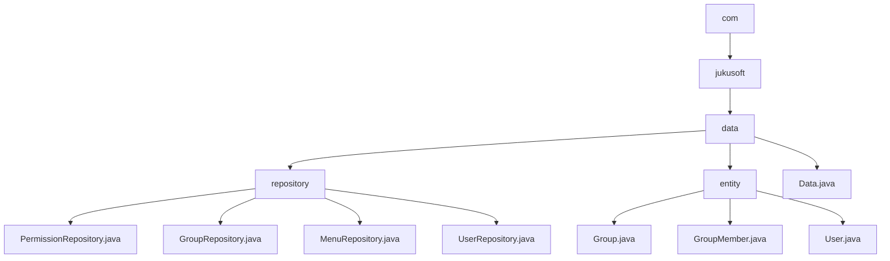

# 基础信息

|      |      |
|------|------|
| 名称 | com |
| 编码语言 | .java |
| 代码路径 | erp-backend/erp-data/src/main/java/com |
| 包名 | erp-backend.erp-data.src.main.java.com |
| 概述说明 | 该模块优化权限、群组、菜单和用户管理，通过缓存与数据库结合提升系统性能。 |

# 说明

## 概述

该代码模块是一个ERP系统的核心数据管理模块，主要负责管理系统中的权限、群组、菜单、用户数据以及相关的数据实体。模块通过结合缓存机制和数据库操作，优化数据查询和更新性能，确保系统在高并发场景下仍能快速响应。模块包含多个仓库类（如`PermissionRepository`、`GroupRepository`、`MenuRepository`、`UserRepository`）和实体类（如`Group`、`GroupMember`、`User`），分别处理不同的业务数据。此外，模块还支持数据的序列化和反序列化，通过实现`JsonSerializable`接口，确保数据在不同格式间的高效转换和互操作性。

## 主要业务场景

1. **权限管理**  
   - `PermissionRepository`类负责管理用户和组的权限信息。通过缓存和数据库查询的结合，系统能够快速获取和更新权限数据，确保在权限验证和授权过程中高效响应。缓存机制减少了数据库访问次数，提升了性能，而数据库查询则确保了在缓存未命中时仍能准确获取权限数据。

2. **群组管理**  
   - `GroupRepository`类负责管理群组数据，提供获取特定群组、用户所属群组列表以及群组ID的功能。通过缓存与数据库操作的结合，优化了群组数据的查询性能，确保系统对群组信息管理的高效性和准确性。
   - `Group`类处理数据库中的组数据，验证`groupID`的有效性，并提供获取组信息的方法。通过实现`JsonSerializable`接口，支持将组信息序列化为JSON格式，便于数据的传输和处理。

3. **菜单管理**  
   - `MenuRepository`类通过缓存和数据库查询的方式，按ID列出菜单项。首先尝试从缓存中查找指定的菜单项，如果缓存中不存在，则进一步查询数据库。这种方法减少了数据库的直接访问次数，提高了数据检索的速度和系统的整体性能，确保了菜单项数据的及时性和准确性。

4. **用户管理**  
   - `UserRepository`类实现了用户查询和密码验证功能，支持缓存和异步处理。通过缓存机制提高查询效率，减少数据库访问次数，同时利用异步处理提升系统响应速度，确保在高并发场景下仍能快速完成用户信息验证和查询操作。
   - `User`类实现了`JsonSerializable`接口，具备获取用户信息和将用户信息转换为JSON格式的功能。该类确保用户数据在不同格式间的高效转换和互操作性，支持用户信息的管理和处理。

5. **组成员管理**  
   - `GroupMember`类管理组成员信息，包含组信息、用户ID和JSON数据。该类通过数据验证确保信息的准确性和一致性，支持对组成员的有效管理。

6. **数据封装与处理**  
   - `Data`类是一个公共类，可能用于封装和处理相关数据，具体功能和属性未在描述中详细说明，但因其公共访问权限，可以被同一项目或不同项目中的其他类访问和使用。

总体而言，该模块通过缓存和数据库的结合，优化了权限、群组、菜单、用户和组成员数据的管理，提升了系统的性能和响应速度，满足了复杂业务场景下的高效数据管理需求。同时，模块支持数据的序列化和反序列化，确保数据在不同格式间的高效转换和互操作性。

### 包内部结构视图

该流程图展示了ERP后端项目中数据模块的层级结构。从根节点`com`开始，逐级展开到`jukusoft`、`data`，然后分别进入`repository`和`entity`子目录。`repository`目录下包含多个Repository类文件，而`entity`目录下则包含多个实体类文件。整体结构清晰，展示了数据模块的文件组织方式。

# 文件列表 File List

| 名称   | 类型  | 说明 |
|-------|------|-------------|
| [jukusoft](jukusoft/_module.md) | package | 该模块优化权限、群组、菜单和用户管理，通过缓存与数据库结合提升系统性能。 |

