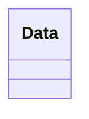
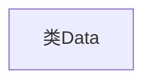

# 基础信息

|      |      |
|------|------|
| 名称 | Data |
| 编码语言 | .java |
| 代码路径 | erp-backend/erp-data/src/main/java/com/jukusoft/data/Data.java |
| 包名 | com.jukusoft.data |
| 依赖项 | [] |
| 概述说明 | 定义了一个名为Data的公共类。 |

# 说明

定义了一个名为Data的公共类，该类具有公共访问权限，意味着它可以被同一项目或不同项目中的其他类访问和使用。这个类可能用于封装和处理相关数据，但具体功能和属性未在描述中详细说明。

# 类列表 Class Summary

| 名称   | 类型  | 说明 |
|-------|------|-------------|
| Data | class | 定义了一个名为Data的公共类。 |

## 类 Data

|      |      |
|------|------|
| 访问范围 | public |
| 类型 | class |
| 名称 | Data |
| 说明 | 定义了一个名为Data的公共类。 |

### UML类图

这段代码定义了一个名为 `Data` 的类，目前该类没有任何成员变量或方法。它是一个空的类，可能用于后续扩展或作为其他类的基类。由于代码内容较少，类图仅展示了 `Data` 类的结构，没有其他依赖或实现关系。

### 内部方法调用关系图

这段代码定义了一个名为 `Data` 的类，目前该类是空的，没有包含任何属性或方法。这是一个简单的类定义，通常作为后续代码扩展的基础。通过这个类，开发者可以逐步添加属性和方法来实现具体的功能。

### 字段列表 Field List

| 名称  | 类型  | 说明 |
|-------|-------|------|

### 方法列表 Method List

| 名称  | 类型  | 说明 |
|-------|-------|------|

