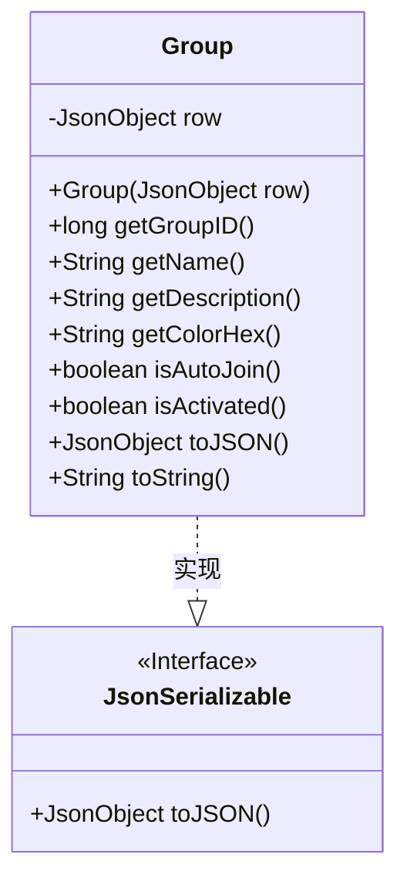
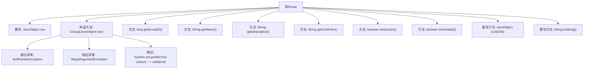

# 基础信息

|      |      |
|------|------|
| 名称 | Group |
| 编码语言 | .java |
| 代码路径 | erp-backend/erp-data/src/main/java/com/jukusoft/data/entity/Group.java |
| 包名 | com.jukusoft.data.entity |
| 依赖项 | ['com.jukusoft.erp.lib.json.JsonSerializable', 'io.vertx.core.json.JsonObject'] |
| 概述说明 | Group类处理数据库行，验证groupID，提供组信息方法并实现JsonSerializable接口。 |

# 说明

Group类负责处理数据库中的行数据，主要功能包括验证groupID的有效性，提供获取组信息的方法，并实现了JsonSerializable接口以便将组信息序列化为JSON格式。该类确保数据的准确性和可访问性，同时支持JSON格式的输出，便于数据的传输和处理。

# 类列表 Class Summary

| 名称   | 类型  | 说明 |
|-------|------|-------------|
| Group | class | Group类处理数据库行，验证groupID，提供获取组信息方法并实现JsonSerializable接口。 |

## 类 Group

|      |      |
|------|------|
| 访问范围 | public |
| 类型 | class |
| 名称 | Group |
| 说明 | Group类处理数据库行，验证groupID，提供获取组信息方法并实现JsonSerializable接口。 |

### UML类图

**描述：**  
`Group` 类实现了 `JsonSerializable` 接口，用于处理与数据库行相关的操作。该类通过构造函数接收一个 `JsonObject` 类型的数据库行，并在构造时进行有效性检查，确保 `row` 不为空且包含 `groupID` 字段。`Group` 类提供了多个方法用于获取 `row` 中的特定字段值，如 `groupID`、`name`、`description` 等，并实现了 `toJSON` 和 `toString` 方法以支持 JSON 序列化。

### 内部方法调用关系图

这段代码定义了一个名为`Group`的类，该类实现了`JsonSerializable`接口。`Group`类的主要作用是封装一个数据库行的`JsonObject`，并提供了一系列方法来获取该行中的特定字段值。构造方法`Group(JsonObject row)`会检查传入的`row`是否为`null`，并确保其包含`groupID`字段，否则会抛出异常。类中还重写了`toJSON()`和`toString()`方法，分别用于返回`JsonObject`和其编码后的字符串表示。

### 字段列表 Field List

| 名称  | 类型  | 说明 |
|-------|-------|------|
| row = null | JsonObject | 声明一个受保护的JsonObject变量row并初始化为null。 |

### 方法列表 Method List

| 名称  | 类型  | 说明 |
|-------|-------|------|
| getDescription | String | 该方法返回指定行的描述字段字符串值。 |
| getName | String | 获取名为"name"的字符串值。 |
| toString | String | 重写toString方法，返回JSON编码字符串。 |
| getColorHex | String | 获取颜色十六进制值的字符串方法。 |
| toJSON | JsonObject | 重写toJSON方法，返回当前行的JsonObject。 |
| getGroupID | long | 获取并返回当前行的groupID值。 |
| isAutoJoin | boolean | 该方法检查"auto_join"字段是否为1，返回布尔值。 |
| isActivated | boolean | 检查行数据中"activated"字段是否为1，返回布尔值。 |

