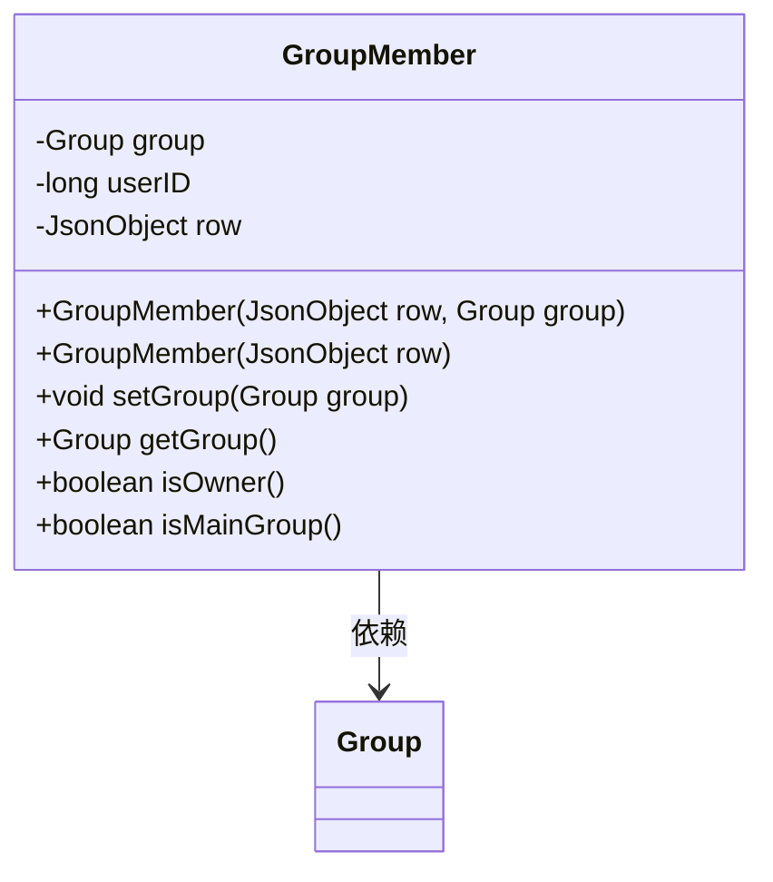
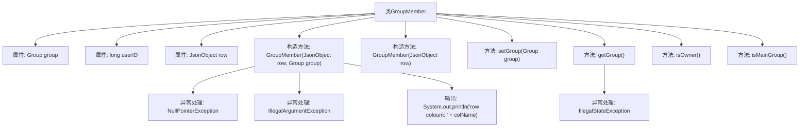

# 基础信息

|      |      |
|------|------|
| 名称 | GroupMember |
| 编码语言 | .java |
| 代码路径 | erp-backend/erp-data/src/main/java/com/jukusoft/data/entity/GroupMember.java |
| 包名 | com.jukusoft.data.entity |
| 依赖项 | ['io.vertx.core.json.JsonObject'] |
| 概述说明 | GroupMember类管理组成员信息，验证数据完整性并支持组操作。 |

# 说明

GroupMember类负责管理组成员信息，主要包含组信息、用户ID和JSON数据。该类确保数据的完整性，并提供对组的操作功能。通过验证数据，保证信息的准确性和一致性，从而支持组成员的有效管理。

# 类列表 Class Summary

| 名称   | 类型  | 说明 |
|-------|------|-------------|
| GroupMember | class | GroupMember类处理组成员信息，包含组、用户ID和JSON数据，验证数据完整性并提供组操作。 |

## 类 GroupMember

|      |      |
|------|------|
| 访问范围 | public |
| 类型 | class |
| 名称 | GroupMember |
| 说明 | GroupMember类处理组成员信息，包含组、用户ID和JSON数据，验证数据完整性并提供组操作。 |

### UML类图

这段代码定义了一个 `GroupMember` 类，用于表示一个群组成员。该类包含三个主要属性：`group`（群组对象）、`userID`（用户ID）和 `row`（JSON对象）。类中提供了两个构造函数，分别用于初始化 `GroupMember` 对象。此外，类中还提供了设置和获取 `group` 的方法，以及判断成员是否为群主或主群组的方法。代码通过检查 `row` 对象中的 `groupID` 字段来确保其有效性，并在必要时抛出异常。

### 内部方法调用关系图

这段代码定义了一个名为 `GroupMember` 的类，该类包含三个属性：`group`、`userID` 和 `row`。类中有两个构造方法，分别用于初始化 `GroupMember` 对象，其中一个构造方法允许传入 `row` 和 `group`，另一个仅传入 `row`。类中还定义了多个方法，包括 `setGroup`、`getGroup`、`isOwner` 和 `isMainGroup`，用于设置和获取 `group` 属性，以及判断成员是否为所有者或主组成员。代码中还包含异常处理，确保 `row` 不为空且包含 `groupID` 字段，并在 `group` 为空时抛出异常。

### 字段列表 Field List

| 名称  | 类型  | 说明 |
|-------|-------|------|
| group = null | Group | 声明一个受保护的Group类型变量group，初始值为null。 |
| userID = 0 | long | 定义受保护的长整型变量userID，初始值为0。 |
| row = null | JsonObject | 声明并初始化一个受保护的JsonObject对象为null。 |

### 方法列表 Method List

| 名称  | 类型  | 说明 |
|-------|-------|------|
| getGroup | Group | 获取组对象，若未设置则抛出异常。 |
| isOwner | boolean | 该方法返回布尔值，判断当前行是否为所有者。 |
| setGroup | void | 设置对象的组属性为指定组。 |
| isMainGroup | boolean | 判断当前行是否为主群组。 |

