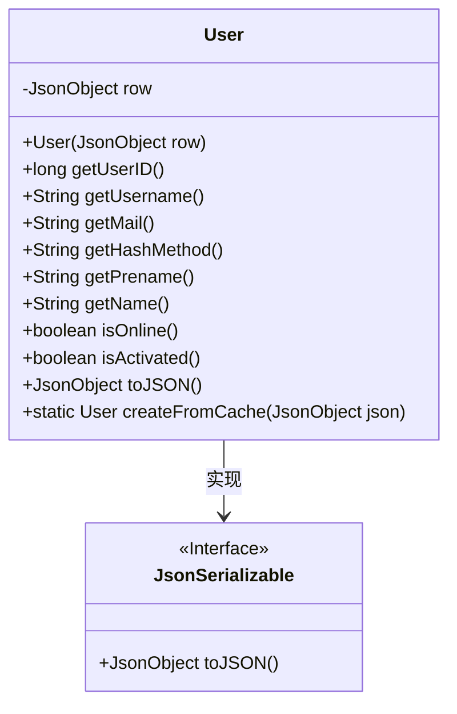
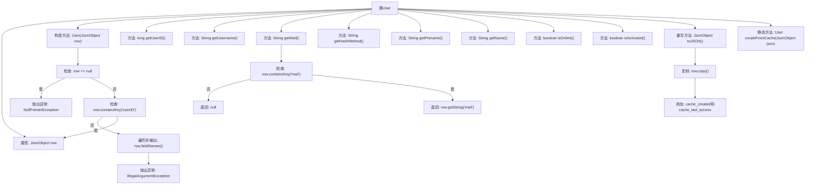

# 基础信息

|      |      |
|------|------|
| 名称 | User |
| 编码语言 | .java |
| 代码路径 | erp-backend/erp-data/src/main/java/com/jukusoft/data/entity/User.java |
| 包名 | com.jukusoft.data.entity |
| 依赖项 | ['com.jukusoft.erp.lib.json.JsonSerializable', 'io.vertx.core.json.JsonObject'] |
| 概述说明 | User类实现JsonSerializable，具备用户信息获取与JSON转换功能。 |

# 说明

User类实现了JsonSerializable接口，具备获取用户信息和将用户信息转换为JSON格式的功能。该类能够有效管理和处理用户数据，确保数据在不同格式间的高效转换和互操作性。

# 类列表 Class Summary

| 名称   | 类型  | 说明 |
|-------|------|-------------|
| User | class | User类实现JsonSerializable，包含用户信息获取和JSON转换功能。 |

## 类 User

|      |      |
|------|------|
| 访问范围 | public |
| 类型 | class |
| 名称 | User |
| 说明 | User类实现JsonSerializable，包含用户信息获取和JSON转换功能。 |

### UML类图

这段代码定义了一个 `User` 类，该类实现了 `JsonSerializable` 接口。`User` 类的主要功能是从一个 `JsonObject` 对象中提取用户信息，并提供了一系列方法来获取用户的不同属性，如用户ID、用户名、邮件等。此外，`User` 类还实现了 `toJSON` 方法，用于将用户信息转换为 JSON 格式，并添加缓存相关的时间戳。`createFromCache` 方法则用于从缓存的 JSON 数据中创建 `User` 对象。整体设计体现了对 JSON 数据的处理和封装能力。

### 内部方法调用关系图

这段代码定义了一个`User`类，该类实现了`JsonSerializable`接口，用于处理用户数据的序列化和反序列化。代码的主要功能包括：通过构造函数初始化用户数据，检查数据有效性，获取用户的各种属性（如用户ID、用户名、邮件等），以及将用户数据转换为JSON格式。代码中还包含对异常情况的处理，如检查输入数据是否为空或缺少必要字段。

### 字段列表 Field List

| 名称  | 类型  | 说明 |
|-------|-------|------|
| row = null | JsonObject | 声明并初始化一个受保护的JsonObject变量row为null。 |

### 方法列表 Method List

| 名称  | 类型  | 说明 |
|-------|-------|------|
| getName | String | 方法getName返回字符串类型的name值。 |
| createFromCache | User | 静态方法从JSON对象创建用户实例。 |
| isActivated | boolean | 方法isActivated检查行数据中activated字段是否为1。 |
| toJSON | JsonObject | 重写toJSON方法，复制行数据并添加缓存时间戳。 |
| getUsername | String | 该方法返回字符串类型的用户名，从当前行的"username"字段获取。 |
| getHashMethod | String | 获取哈希方法的字符串值。 |
| getMail | String | 检查并返回行数据中的邮件字段，若不存在则返回空值。 |
| isOnline | boolean | 检查行数据中online字段是否为1，返回布尔值。 |
| getUserID | long | 该方法返回当前行的用户ID字段值。 |
| getPrename | String | 获取姓名字段值的Java方法。 |

