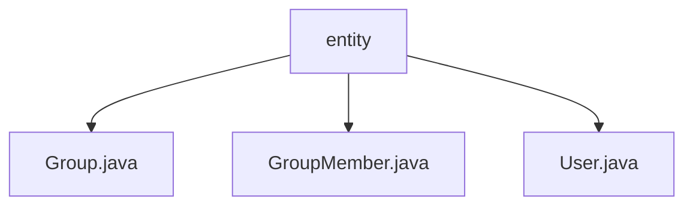

# 基础信息

|      |      |
|------|------|
| 名称 | entity |
| 编码语言 | .java |
| 代码路径 | erp-backend/erp-data/src/main/java/com/jukusoft/data/entity |
| 包名 | erp-backend.erp-data.src.main.java.com.jukusoft.data.entity |
| 概述说明 | Group类验证groupID并序列化为JSON，GroupMember类管理组成员信息，User类处理用户数据并支持JSON转换。 |

# 说明

## 概述

该代码模块主要涉及ERP系统中的用户和组管理功能，包含三个核心类：`Group`、`GroupMember`和`User`。这些类分别负责处理组信息、组成员信息以及用户信息的管理。所有类都实现了`JsonSerializable`接口，支持将数据序列化为JSON格式，便于数据的传输和处理。模块通过数据验证和完整性检查，确保数据的准确性和一致性，从而支持系统的高效运行。

## 主要业务场景

1. **组管理**  
   - `Group`类负责处理数据库中的组数据，验证`groupID`的有效性，并提供获取组信息的方法。通过实现`JsonSerializable`接口，支持将组信息序列化为JSON格式，便于数据的传输和处理。

2. **组成员管理**  
   - `GroupMember`类管理组成员信息，包含组信息、用户ID和JSON数据。该类通过数据验证确保信息的准确性和一致性，支持对组成员的有效管理。

3. **用户管理**  
   - `User`类实现了`JsonSerializable`接口，具备获取用户信息和将用户信息转换为JSON格式的功能。该类确保用户数据在不同格式间的高效转换和互操作性，支持用户信息的管理和处理。

这些类共同协作，支持ERP系统中用户和组相关数据的存储、验证、转换和管理，确保系统的高效运行和数据的准确性。

### 包内部结构视图

该流程图展示了`erp-backend/erp-data/src/main/java/com/jukusoft/data/entity`路径下的文件层级关系。`entity`作为根节点，包含了三个子节点：`Group.java`、`GroupMember.java`和`User.java`。这些文件均位于`entity`目录下，且没有进一步的子目录结构。

# 文件列表 File List

| 名称   | 类型  | 说明 |
|-------|------|-------------|
| [GroupMember.java](GroupMember.md) | file | GroupMember类管理组成员信息，验证数据完整性并支持组操作。 |
| [User.java](User.md) | file | User类实现JsonSerializable，具备用户信息获取与JSON转换功能。 |
| [Group.java](Group.md) | file | Group类处理数据库行，验证groupID，提供组信息方法并实现JsonSerializable接口。 |

