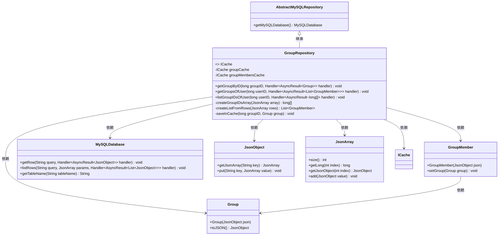
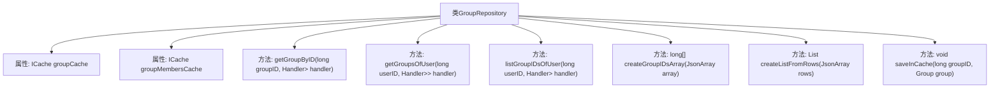

# 基础信息

|      |      |
|------|------|
| 名称 | GroupRepository |
| 编码语言 | .java |
| 代码路径 | erp-backend/erp-data/src/main/java/com/jukusoft/data/repository/GroupRepository.java |
| 包名 | com.jukusoft.data.repository |
| 依赖项 | ['com.jukusoft.data.entity.Group', 'com.jukusoft.data.entity.GroupMember', 'com.jukusoft.data.entity.User', 'com.jukusoft.erp.lib.cache.CacheTypes', 'com.jukusoft.erp.lib.cache.ICache', 'com.jukusoft.erp.lib.cache.InjectCache', 'com.jukusoft.erp.lib.database.AbstractMySQLRepository', 'io.vertx.core.AsyncResult', 'io.vertx.core.Future', 'io.vertx.core.Handler', 'io.vertx.core.json.JsonArray', 'io.vertx.core.json.JsonObject', 'java.util.ArrayList', 'java.util.List'] |
| 概述说明 | GroupRepository类管理群组数据，支持缓存与数据库操作，提供群组获取、用户群组列表及群组ID功能。 |

# 说明

GroupRepository类负责管理群组数据，具备缓存查询和数据库操作的能力。该类提供获取特定群组、用户所属群组列表以及群组ID的功能，确保数据访问的高效性和准确性。通过结合缓存与数据库操作，优化了群组数据的查询性能，满足系统对群组信息管理的需求。

# 类列表 Class Summary

| 名称   | 类型  | 说明 |
|-------|------|-------------|
| GroupRepository | class | GroupRepository类管理群组数据，支持缓存查询与数据库操作，提供获取群组、用户群组列表及群组ID功能。 |

## 类 GroupRepository

|      |      |
|------|------|
| 访问范围 | public |
| 类型 | class |
| 名称 | GroupRepository |
| 说明 | GroupRepository类管理群组数据，支持缓存查询与数据库操作，提供获取群组、用户群组列表及群组ID功能。 |

### UML类图

这段代码定义了一个 `GroupRepository` 类，继承自 `AbstractMySQLRepository`，用于管理与群组相关的数据操作。`GroupRepository` 类通过 `ICache` 接口实现缓存功能，支持从缓存或数据库中获取群组信息、用户群组列表以及用户群组ID列表。代码中还定义了 `Group` 和 `GroupMember` 类，用于表示群组和群组成员信息。`MySQLDatabase` 类用于执行SQL查询，`JsonObject` 和 `JsonArray` 类用于处理JSON数据。整个类图展示了类之间的继承和依赖关系，清晰地描述了数据操作的流程。

### 内部方法调用关系图

**描述：**  
`GroupRepository` 类继承自 `AbstractMySQLRepository`，主要用于管理组和组成员的数据。它包含两个缓存属性 `groupCache` 和 `groupMembersCache`，分别用于缓存组和组成员信息。类中的方法 `getGroupByID`、`getGroupsOfUser` 和 `listGroupIDsOfUser` 分别用于通过ID获取组、获取用户的组成员列表以及获取用户的组ID列表。这些方法首先检查缓存中是否存在所需数据，若存在则直接返回，否则从数据库中查询并将结果缓存。此外，类中还有一些辅助方法用于处理数据和缓存操作。

### 字段列表 Field List

| 名称  | 类型  | 说明 |
|-------|-------|------|
| groupCache | ICache | 使用本地内存缓存注入名为group-cache的缓存实例。 |
| groupMembersCache | ICache | 注入名为group-members-cache的Hazelcast缓存实例。 |

### 方法列表 Method List

| 名称  | 类型  | 说明 |
|-------|-------|------|
| createGroupIDsArray | long[] | 将JsonArray转换为long数组并返回。 |
| listGroupIDsOfUser | void | 方法通过缓存或数据库查询获取用户所属群组ID列表。 |
| getGroupByID | void | 通过ID获取组信息，先查缓存，无则从数据库读取并缓存。 |
| createListFromRows | List<GroupMember> | 方法将JsonArray转换为GroupMember列表，处理异常并返回结果。 |
| saveInCache | void | 将群组信息以JSON格式存入缓存，键名为"group-"加群组ID。 |
| getGroupsOfUser | void | 根据用户ID获取用户组信息，优先从缓存读取，未命中则查询数据库并缓存结果。 |

