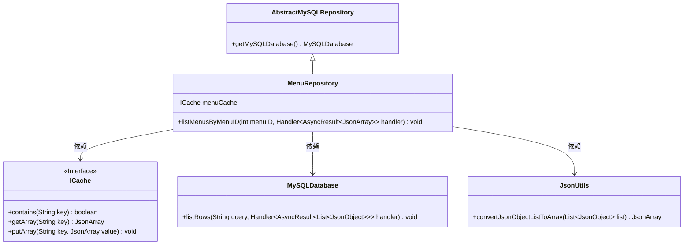
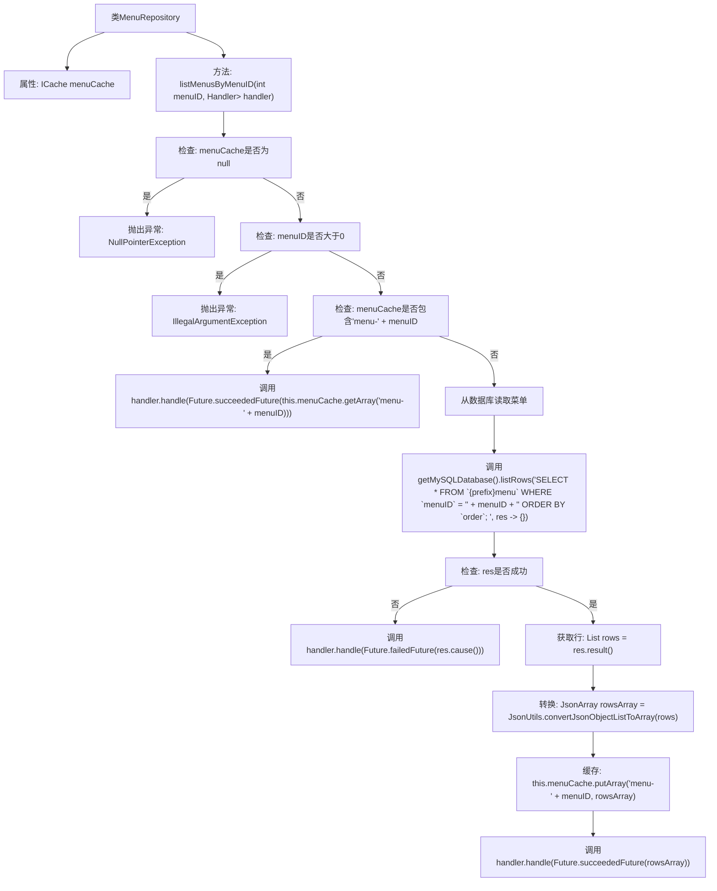

# 基础信息

|      |      |
|------|------|
| 名称 | MenuRepository |
| 编码语言 | .java |
| 代码路径 | erp-backend/erp-data/src/main/java/com/jukusoft/data/repository/MenuRepository.java |
| 包名 | com.jukusoft.data.repository |
| 依赖项 | ['com.jukusoft.data.entity.Group', 'com.jukusoft.erp.lib.cache.CacheTypes', 'com.jukusoft.erp.lib.cache.ICache', 'com.jukusoft.erp.lib.cache.InjectCache', 'com.jukusoft.erp.lib.database.AbstractMySQLRepository', 'com.jukusoft.erp.lib.utils.JsonUtils', 'io.vertx.core.AsyncResult', 'io.vertx.core.Future', 'io.vertx.core.Handler', 'io.vertx.core.json.JsonArray', 'io.vertx.core.json.JsonObject', 'java.util.List'] |
| 概述说明 | MenuRepository类通过缓存和数据库查询按ID列出菜单项。 |

# 说明

MenuRepository类的主要功能是通过缓存和数据库查询的方式，按ID列出菜单项。该类通过结合缓存机制和数据库操作，优化了菜单项的获取效率。首先，它尝试从缓存中查找指定的菜单项，如果缓存中不存在，则进一步查询数据库以获取相关数据。这种方法不仅减少了数据库的直接访问次数，还提高了数据检索的速度和系统的整体性能。通过这种方式，MenuRepository类有效地管理了菜单项的数据获取过程，确保了数据的及时性和准确性。

# 类列表 Class Summary

| 名称   | 类型  | 说明 |
|-------|------|-------------|
| MenuRepository | class | MenuRepository类通过缓存和数据库查询按ID列出菜单项。 |

## 类 MenuRepository

|      |      |
|------|------|
| 访问范围 | public |
| 类型 | class |
| 名称 | MenuRepository |
| 说明 | MenuRepository类通过缓存和数据库查询按ID列出菜单项。 |

### UML类图

这段代码描述了一个 `MenuRepository` 类，该类继承自 `AbstractMySQLRepository`，并依赖于 `ICache`、`MySQLDatabase` 和 `JsonUtils`。`MenuRepository` 类中的 `listMenusByMenuID` 方法用于根据 `menuID` 列出菜单项，首先检查缓存是否存在，若存在则直接从缓存中获取数据，否则从数据库中查询并将结果缓存。该方法通过 `Handler` 处理异步结果，确保数据的正确性和性能优化。

### 内部方法调用关系图

这段代码定义了一个`MenuRepository`类，用于根据`menuID`从缓存或数据库中获取菜单数据。首先检查缓存是否可用和`menuID`是否有效，若缓存中存在数据则直接返回，否则从数据库中查询并将结果缓存。流程图展示了代码的逻辑流程，包括异常处理、缓存检查和数据库查询等步骤。

### 字段列表 Field List

| 名称  | 类型  | 说明 |
|-------|-------|------|
| menuCache | ICache | 使用Hazelcast缓存注入名为"menu-cache"的缓存实例。 |

### 方法列表 Method List

| 名称  | 类型  | 说明 |
|-------|-------|------|
| listMenusByMenuID | void | 根据菜单ID查询菜单，先检查缓存，若无则从数据库读取并缓存结果。 |

