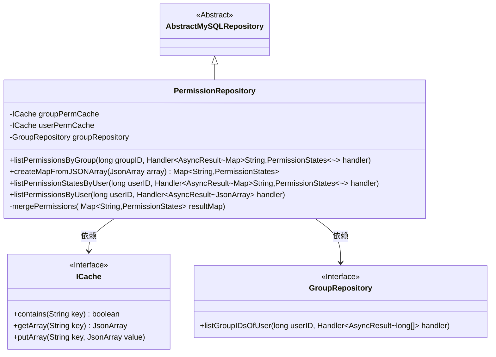

# 基础信息

|      |      |
|------|------|
| 名称 | PermissionRepository |
| 编码语言 | .java |
| 代码路径 | erp-backend/erp-data/src/main/java/com/jukusoft/data/repository/PermissionRepository.java |
| 包名 | com.jukusoft.data.repository |
| 依赖项 | ['com.jukusoft.data.entity.Group', 'com.jukusoft.data.entity.GroupMember', 'com.jukusoft.erp.lib.cache.CacheTypes', 'com.jukusoft.erp.lib.cache.ICache', 'com.jukusoft.erp.lib.cache.InjectCache', 'com.jukusoft.erp.lib.database.AbstractMySQLRepository', 'com.jukusoft.erp.lib.database.InjectRepository', 'com.jukusoft.erp.lib.permission.PermissionStates', 'com.jukusoft.erp.lib.utils.JsonUtils', 'io.vertx.core.AsyncResult', 'io.vertx.core.CompositeFuture', 'io.vertx.core.Future', 'io.vertx.core.Handler', 'io.vertx.core.impl.CompositeFutureImpl', 'io.vertx.core.json.JsonArray', 'io.vertx.core.json.JsonObject', 'java.util'] |
| 概述说明 | 权限仓库管理用户和组权限，支持缓存与数据库查询。 |

# 说明

权限仓库类负责管理用户和组的权限，支持通过缓存和数据库查询来获取和更新权限信息。该模块旨在高效地处理权限数据，确保系统在权限验证和授权过程中能够快速响应。通过缓存机制，系统可以减少对数据库的直接访问，提高性能。同时，数据库查询功能确保在缓存未命中时仍能准确获取权限数据。该设计既保证了权限管理的灵活性，又提升了系统的整体效率。

# 类列表 Class Summary

| 名称   | 类型  | 说明 |
|-------|------|-------------|
| PermissionRepository | class | 权限仓库类管理用户和组权限，支持缓存和数据库查询。 |

## 类 PermissionRepository

|      |      |
|------|------|
| 访问范围 | public |
| 类型 | class |
| 名称 | PermissionRepository |
| 说明 | 权限仓库类管理用户和组权限，支持缓存和数据库查询。 |

### UML类图

类图描述：  
`PermissionRepository` 类继承自 `AbstractMySQLRepository`，并依赖于 `ICache` 和 `GroupRepository` 接口。`PermissionRepository` 类包含多个方法，用于处理与权限相关的操作，如通过组ID或用户ID获取权限状态，并将结果缓存到 `ICache` 中。`GroupRepository` 接口用于获取用户所属的组ID列表。`ICache` 接口提供了缓存操作的基本方法，如检查缓存是否存在、获取缓存数据和存储缓存数据。

### 内部方法调用关系图

```mermaid
graph TD
    A["类PermissionRepository"]
    B["属性: ICache groupPermCache"]
    C["属性: ICache userPermCache"]
    D["属性: GroupRepository groupRepository"]
    E["方法: listPermissionsByGroup(long groupID, Handler<AsyncResult<Map<String,PermissionStates>>> handler)"]
    F["方法: createMapFromJSONArray(JsonArray array)"]
    G["方法: listPermissionStatesByUser(long userID, Handler<AsyncResult<Map<String,PermissionStates>>> handler)"]
    H["方法: listPermissionsByUser(long userID, Handler<AsyncResult<JsonArray>> handler)"]
    I["方法: mergePermissions(Map<String,PermissionStates> permMap, Map<String,PermissionStates> resultMap)"]
    J["步骤: 检查groupID是否合法"]
    K["步骤: 检查groupPermCache是否为空"]
    L["步骤: 检查缓存中是否包含groupID"]
    M["步骤: 从缓存中获取JsonArray并转换为Map"]
    N["步骤: 调用handler处理结果"]
    O["步骤: 从数据库中加载权限"]
    P["步骤: 将数据库结果转换为JsonArray并缓存"]
    Q["步骤: 将JsonArray转换为Map并调用handler处理结果"]
    R["步骤: 检查groupRepository是否为空"]
    S["步骤: 获取用户的组ID列表"]
    T["步骤: 为每个组ID调用listPermissionsByGroup"]
    U["步骤: 等待所有异步操作完成"]
    V["步骤: 合并权限并调用handler处理结果"]
    W["步骤: 检查缓存中是否包含userID"]
    X["步骤: 从缓存中获取JsonArray并调用handler处理结果"]
    Y["步骤: 调用listPermissionStatesByUser获取权限"]
    Z["步骤: 将权限Map转换为JsonArray并缓存"]
    AA["步骤: 调用handler处理结果"]

    A --> B
    A --> C
    A --> D
    A --> E
    A --> F
    A --> G
    A --> H
    A --> I
    E --> J
    E --> K
    E --> L
    E --> M
    E --> N
    E --> O
    E --> P
    E --> Q
    G --> R
    G --> S
    G --> T
    G --> U
    G --> V
    H --> W
    H --> X
    H --> Y
    H --> Z
    H --> AA
```

这段代码展示了`PermissionRepository`类的结构和主要方法。该类负责管理用户和组的权限，支持从缓存或数据库中获取权限数据，并将结果转换为不同的格式。主要方法包括`listPermissionsByGroup`、`listPermissionStatesByUser`和`listPermissionsByUser`，它们分别处理组权限、用户权限状态和用户权限列表的获取。代码还包含缓存管理和异步操作的处理，确保高效的数据访问和操作。

### 字段列表 Field List

| 名称  | 类型  | 说明 |
|-------|-------|------|
| groupPermCache | ICache | 注入名为"group-permissions-cache"的Hazelcast缓存实例。 |
| userPermCache | ICache | 使用Hazelcast缓存注入用户权限缓存实例。 |
| groupRepository | GroupRepository | 注入GroupRepository实例以供使用。 |

### 方法列表 Method List

| 名称  | 类型  | 说明 |
|-------|-------|------|
| listPermissionStatesByUser | void | 该方法通过用户ID获取权限状态，合并组权限后返回结果。 |
| createMapFromJSONArray | Map<String,PermissionStates> | 将JSON数组转换为权限状态映射。 |
| listPermissionsByUser | void | 废弃方法：通过用户ID获取权限列表，先查缓存，无则从数据库获取并缓存。 |
| mergePermissions | void | 合并权限映射，优先处理NEVER和DISALLOW状态。 |
| listPermissionsByGroup | void | 废弃方法：根据组ID获取权限，先查缓存，无则从数据库加载并缓存。 |

