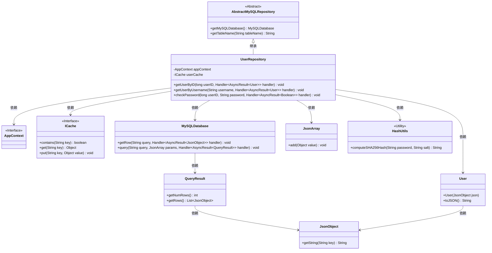
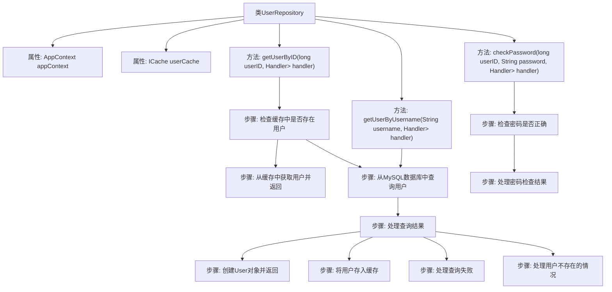

# 基础信息

|      |      |
|------|------|
| 名称 | UserRepository |
| 编码语言 | .java |
| 代码路径 | erp-backend/erp-data/src/main/java/com/jukusoft/data/repository/UserRepository.java |
| 包名 | com.jukusoft.data.repository |
| 依赖项 | ['com.jukusoft.data.entity.User', 'com.jukusoft.erp.lib.cache.CacheTypes', 'com.jukusoft.erp.lib.cache.ICache', 'com.jukusoft.erp.lib.cache.InjectCache', 'com.jukusoft.erp.lib.context.AppContext', 'com.jukusoft.erp.lib.database.AbstractMySQLRepository', 'com.jukusoft.erp.lib.database.InjectAppContext', 'com.jukusoft.erp.lib.utils.HashUtils', 'io.vertx.core.AsyncResult', 'io.vertx.core.Future', 'io.vertx.core.Handler', 'io.vertx.core.json.JsonArray', 'io.vertx.core.json.JsonObject'] |
| 概述说明 | 用户仓库类实现查询和密码验证，支持缓存和异步处理。 |

# 说明

用户仓库类实现了用户查询和密码验证功能，支持缓存和异步处理。该功能通过缓存机制提高查询效率，减少数据库访问次数，同时利用异步处理提升系统响应速度，确保在高并发场景下仍能快速完成用户信息验证和查询操作。

# 类列表 Class Summary

| 名称   | 类型  | 说明 |
|-------|------|-------------|
| UserRepository | class | 用户仓库类实现用户查询和密码验证功能，支持缓存和异步处理。 |

## 类 UserRepository

|      |      |
|------|------|
| 访问范围 | public |
| 类型 | class |
| 名称 | UserRepository |
| 说明 | 用户仓库类实现用户查询和密码验证功能，支持缓存和异步处理。 |

### UML类图

**描述**：  
`UserRepository`类继承自`AbstractMySQLRepository`，负责用户数据的访问和操作。它依赖于`AppContext`和`ICache`接口，分别用于应用上下文和缓存管理。通过`MySQLDatabase`类与数据库交互，获取用户数据并封装为`User`对象。`UserRepository`还提供了检查密码的功能，使用`HashUtils`进行密码哈希计算。整个类图展示了`UserRepository`与多个类和接口的依赖关系，体现了其在用户数据管理中的核心作用。

### 内部方法调用关系图

**描述：**
`UserRepository`类继承自`AbstractMySQLRepository`，负责处理用户数据的获取和验证。它包含三个主要方法：`getUserByID`、`getUserByUsername`和`checkPassword`。`getUserByID`方法首先检查缓存中是否存在用户，如果存在则直接返回，否则从MySQL数据库中查询用户并处理查询结果。`getUserByUsername`方法类似，但未实现缓存检查。`checkPassword`方法用于验证用户密码是否正确，通过查询数据库并比较哈希值来确认密码是否匹配。

### 字段列表 Field List

| 名称  | 类型  | 说明 |
|-------|-------|------|
| userCache | ICache | 使用本地内存缓存注入用户缓存实例。 |
| appContext | AppContext | 注入应用上下文以访问全局资源。 |

### 方法列表 Method List

| 名称  | 类型  | 说明 |
|-------|-------|------|
| checkPassword | void | 检查用户密码，验证用户ID和密码是否匹配，返回布尔结果。 |
| getUserByUsername | void | 通过用户名查询用户，先检查缓存，再查询数据库，返回用户对象或空。 |
| getUserByID | void | 通过ID获取用户，先查缓存，若无则查数据库并缓存结果。 |

