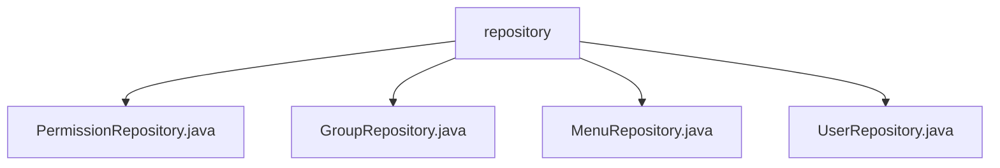

# 基础信息

|      |      |
|------|------|
| 名称 | repository |
| 编码语言 | .java |
| 代码路径 | erp-backend/erp-data/src/main/java/com/jukusoft/data/repository |
| 包名 | erp-backend.erp-data.src.main.java.com.jukusoft.data.repository |
| 概述说明 | 权限、群组、菜单、用户仓库类通过缓存和数据库查询优化数据访问，提升系统性能和响应速度。 |

# 说明

## 概述

该代码模块主要负责管理系统中的权限、群组、菜单和用户数据。通过结合缓存机制和数据库操作，模块旨在优化数据查询和更新性能，确保系统在高并发场景下仍能快速响应。模块中的各个仓库类（`PermissionRepository`、`GroupRepository`、`MenuRepository`、`UserRepository`）分别处理不同的业务数据，并通过缓存减少对数据库的直接访问，从而提高系统整体效率。

## 主要业务场景

1. **权限管理**：`PermissionRepository` 类负责管理用户和组的权限信息。通过缓存和数据库查询的结合，系统能够快速获取和更新权限数据，确保在权限验证和授权过程中高效响应。缓存机制减少了数据库访问次数，提升了性能，而数据库查询则确保了在缓存未命中时仍能准确获取权限数据。

2. **群组管理**：`GroupRepository` 类负责管理群组数据，提供获取特定群组、用户所属群组列表以及群组ID的功能。通过缓存与数据库操作的结合，优化了群组数据的查询性能，确保系统对群组信息管理的高效性和准确性。

3. **菜单管理**：`MenuRepository` 类通过缓存和数据库查询的方式，按ID列出菜单项。首先尝试从缓存中查找指定的菜单项，如果缓存中不存在，则进一步查询数据库。这种方法减少了数据库的直接访问次数，提高了数据检索的速度和系统的整体性能，确保了菜单项数据的及时性和准确性。

4. **用户管理**：`UserRepository` 类实现了用户查询和密码验证功能，支持缓存和异步处理。通过缓存机制提高查询效率，减少数据库访问次数，同时利用异步处理提升系统响应速度，确保在高并发场景下仍能快速完成用户信息验证和查询操作。

总体而言，该模块通过缓存和数据库的结合，优化了权限、群组、菜单和用户数据的管理，提升了系统的性能和响应速度，满足了复杂业务场景下的高效数据管理需求。

### 包内部结构视图

该流程图展示了`repository`文件夹下的四个Java文件：`PermissionRepository.java`、`GroupRepository.java`、`MenuRepository.java`和`UserRepository.java`。这些文件均位于`repository`目录下，表明它们是同一层级的不同文件，用于处理不同的数据存储操作。

# 文件列表 File List

| 名称   | 类型  | 说明 |
|-------|------|-------------|
| [UserRepository.java](UserRepository.md) | file | 用户仓库类实现查询和密码验证，支持缓存和异步处理。 |
| [MenuRepository.java](MenuRepository.md) | file | MenuRepository类通过缓存和数据库查询按ID列出菜单项。 |
| [GroupRepository.java](GroupRepository.md) | file | GroupRepository类管理群组数据，支持缓存与数据库操作，提供群组获取、用户群组列表及群组ID功能。 |
| [PermissionRepository.java](PermissionRepository.md) | file | 权限仓库管理用户和组权限，支持缓存与数据库查询。 |

