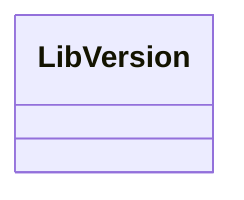

# 基础信息

|      |      |
|------|------|
| 名称 | LibVersion |
| 编码语言 | .java |
| 代码路径 | erp-backend/erp-library/src/main/java/com.jukusoft/erp/lib/LibVersion.java |
| 包名 | com.jukusoft.erp.lib |
| 依赖项 | [] |
| 概述说明 | 定义了一个名为LibVersion的公共空类。 |

# 说明

定义了一个名为LibVersion的公共类，该类目前为空，不包含任何属性或方法。这表明该类可能作为后续开发的基础结构，用于实现特定功能或模块。

# 类列表 Class Summary

| 名称   | 类型  | 说明 |
|-------|------|-------------|
| LibVersion | class | 定义了一个空的公共类LibVersion。 |

## 类 LibVersion

|      |      |
|------|------|
| 访问范围 | public |
| 类型 | class |
| 名称 | LibVersion |
| 说明 | 定义了一个空的公共类LibVersion。 |

### UML类图

该代码定义了一个名为 `LibVersion` 的类，该类目前为空，没有任何成员变量或方法。`LibVersion` 类可能用于表示某个库的版本信息，但目前尚未实现具体功能。后续可以在此类中添加与版本相关的属性和方法，如版本号、发布日期等。

### 内部方法调用关系图

这段代码定义了一个名为 `LibVersion` 的类，目前该类是空的，没有包含任何属性或方法。流程图展示了 `LibVersion` 类的结构，由于类内没有其他元素，因此图中只有一个节点表示该类。后续可以通过添加属性和方法来扩展该类的功能。

### 字段列表 Field List

| 名称  | 类型  | 说明 |
|-------|-------|------|

### 方法列表 Method List

| 名称  | 类型  | 说明 |
|-------|-------|------|

