# 基础信息

|      |      |
|------|------|
| 名称 | lib |
| 编码语言 | .java |
| 代码路径 | erp-backend/erp-library/src/main/java/com.jukusoft/erp/lib |
| 包名 | erp-backend.erp-library.src.main.java.com.jukusoft.erp.lib |
| 概述说明 | 该Java库用于ERP系统，处理JSON序列化、加载、数据交换和持久化，简化数据处理流程。 |

# 说明

## 概述
该代码模块是一个ERP（企业资源规划）系统的后端库，提供了多种功能以支持系统的核心业务操作。模块涵盖了JSON数据处理、日志记录、应用上下文管理、控制器逻辑、API请求与响应处理、模块管理、权限管理、缓存管理、异常处理、会话管理、工具类、数据库操作以及密钥库管理等功能。通过模块化的设计，该库为ERP系统提供了高效、可扩展且易于维护的基础架构，支持复杂的业务需求和系统集成。

## 主要业务场景
1. **JSON数据处理**：模块提供了JSON序列化和反序列化功能，支持Java对象与JSON格式之间的转换，便于数据交换和持久化。
2. **日志记录**：通过集成的日志服务，模块支持多种日志级别，确保系统运行信息的全面记录和监控。
3. **应用上下文管理**：模块通过`AppContext`接口及其实现类，统一管理Vertx、Hazelcast、数据库、缓存、权限等关键组件，确保系统资源的高效利用。
4. **控制器逻辑处理**：模块提供了控制器基类`AbstractController`，支持处理与Vertx框架相关的请求和响应逻辑，确保业务逻辑的正确执行。
5. **API请求与响应处理**：模块通过`ApiRequest`、`ApiResponse`等类，支持API请求的编码、解码、管理和响应封装，确保数据交换的完整性和安全性。
6. **模块管理**：模块通过`IModule`接口和`AbstractModule`抽象类，支持模块的集成、管理和初始化，提供统一的框架支持。
7. **权限管理**：模块通过`PermissionRequired`、`LoginRequired`等注解，支持权限控制、登录验证和日志注入，确保系统的安全性和合规性。
8. **缓存管理**：模块提供了多种缓存类型的实现，包括文件缓存、本地内存缓存和Hazelcast分布式缓存，支持高效的数据访问和资源管理。
9. **异常处理**：模块定义了一系列自定义异常类，用于处理服务、仓库、缓存缺失等情况，确保系统的健壮性和可维护性。
10. **会话管理**：模块利用Hazelcast技术实现分布式会话管理，支持用户会话的高效存储、检索和管理，确保会话数据的高可用性和一致性。
11. **工具类**：模块提供了多种实用工具类，支持哈希计算、JSON数据转换、文件操作等功能，简化开发流程并提高代码效率。
12. **数据库操作**：模块支持与MySQL和Hazelcast数据库的交互，提供数据库连接、仓库管理、事务处理等功能，确保数据的一致性和完整性。
13. **密钥库管理**：模块支持生成自签名X.509证书并将其保存为JKS格式的密钥库，适用于安全通信和数据加密。

通过这些功能，该模块为ERP系统提供了全面的支持，能够满足复杂的业务需求和高并发的系统场景。

### 包内部结构视图

```mermaid
graph TD
    lib --> json
    lib --> logger
    lib --> context
    lib --> controller
    lib --> message
    lib --> module
    lib --> LibVersion.java
    lib --> service
    lib --> annotation
    lib --> route
    lib --> gateway
    lib --> permission
    lib --> cache
    lib --> logging
    lib --> exception
    lib --> session
    lib --> utils
    lib --> database
    lib --> keystore
    json --> JsonSerializable.java
    json --> JsonLoadable.java
    logger --> HzLogger.java
    context --> AppContext.java
    context --> AppContextImpl.java
    controller --> AbstractController.java
    controller --> IController.java
    message --> request
    message --> StatusCode.java
    message --> response
    module --> IModule.java
    module --> AbstractModule.java
    service --> IService.java
    service --> InjectService.java
    annotation --> PermissionRequired.java
    annotation --> LoginRequired.java
    annotation --> InjectLogger.java
    route --> RouteHandlerWithoutReturn.java
    route --> RouteHandler.java
    route --> Route.java
    gateway --> ApiGateway.java
    gateway --> ResponseHandler.java
    permission --> PermissionManager.java
    permission --> PermissionService.java
    permission --> PermissionStates.java
    cache --> InjectCache.java
    cache --> ICache.java
    cache --> impl
    cache --> CacheManager.java
    cache --> CacheTypes.java
    logging --> ILogging.java
    exception --> RequiredServiceNotFoundException.java
    exception --> HandlerException.java
    exception --> RequiredRepositoryNotFoundException.java
    exception --> CacheNotFoundException.java
    session --> SessionManager.java
    session --> Session.java
    session --> ChangeableSessionManager.java
    session --> impl
    utils --> HashUtils.java
    utils --> JsonUtils.java
    utils --> FileUtils.java
    database --> HazelcastRepository.java
    database --> MySQLDatabase.java
    database --> Repository.java
    database --> InjectRepository.java
    database --> InjectAppContext.java
    database --> InjectDatabase.java
    database --> AbstractMySQLRepository.java
    database --> DatabaseManager.java
    database --> Database.java
    database --> impl
    keystore --> KeyStoreGenerator.java
    request --> ApiRequestCodec.java
    request --> ApiRequest.java
    response --> ApiResponse.java
    response --> ApiResponseCodec.java
    impl --> DefaultCacheManager.java
    impl --> FileSystemCache.java
    impl --> HazelcastCache.java
    impl --> LocalMemoryCache.java
    impl --> HzMapSessionManager.java
    impl --> SessionIDGenerator.java
    impl --> HzJCacheSessionManager.java
    impl --> DatabaseManagerImpl.java
    impl --> MySQLRepository.java
```

该流程图展示了ERP库的模块结构及其层级关系。从根节点`lib`开始，分支为多个子模块，如`json`、`logger`、`context`等，每个子模块下又包含具体的类文件。这种结构清晰地反映了代码的组织方式，便于理解和管理。

# 文件列表 File List

| 名称   | 类型  | 说明 |
|-------|------|-------------|
| [utils](utils/_module.md) | package | HashUtils类提供多种哈希计算，JsonUtils类转换JsonObject为JsonArray，FileUtils类处理文件读写及异常。 |
| [LibVersion.java](LibVersion.md) | file | 定义了一个名为LibVersion的公共空类。 |
| [logger](logger/_module.md) | package | HzLogger类实现ILogging接口，支持多级日志，发布至Hazelcast主题并输出控制台。 |
| [keystore](keystore/_module.md) | package | 生成自签名X.509证书并保存为JKS格式密钥库。 |
| [database](database/_module.md) | package | HazelcastRepository处理MySQL交互，支持查询、更新和事务管理。MySQLDatabase空内容无法总结。Repository空内容无法总结。InjectRepository空内容无法总结。InjectAppContext空内容无法总结。InjectDatabase抽象类实现MySQL接口，提供初始化和获取实例方法。AbstractMySQLRepository空内容无法总结。DatabaseManager空内容无法总结。Database管理MySQL和Hazelcast，支持仓库实例操作。MySQLRepository空内容无法总结。 |
| [session](session/_module.md) | package | SessionManager管理会话ID、属性和登录状态，支持JSON序列化。ChangeableSessionManager利用Hazelcast实现分布式会话管理，确保高可用性和并发处理。 |
| [exception](exception/_module.md) | package | 自定义异常类处理服务、仓库、缓存缺失，增强系统健壮性和可维护性。 |
| [logging](logging/_module.md) | package | 信息为空，无法生成概要描述。 |
| [cache](cache/_module.md) | package | 该模块提供多种缓存实现，包括文件、本地内存和分布式缓存，通过统一接口管理，确保高效运行。 |
| [permission](permission/_module.md) | package | 权限服务类管理用户和组权限，结合缓存和数据库优化性能与数据可靠性。 |
| [gateway](gateway/_module.md) | package | 输入内容为空，无法生成总结描述。 |
| [route](route/_module.md) | package | 输入内容为空，无法生成总结描述。 |
| [annotation](annotation/_module.md) | package | 提供的内容为空，无法生成总结描述。 |
| [service](service/_module.md) | package | 输入内容为空，无法生成总结描述。 |
| [module](module/_module.md) | package | AbstractModule实现IModule，管理Vertx、日志、服务和路由，支持依赖注入，增强灵活性和扩展性。 |
| [message](message/_module.md) | package | 模块处理API请求与响应的编码、解码及管理，确保数据完整性和安全性。 |
| [controller](controller/_module.md) | package | AbstractController类实现IController接口，管理Vertx、AppContext和ILogging实例，提供初始化功能。 |
| [context](context/_module.md) | package | AppContextImpl管理Vertx、日志、Hazelcast、会话、数据库、缓存和权限服务。 |
| [json](json/_module.md) | package | 无法生成描述，缺少具体内容。 |

