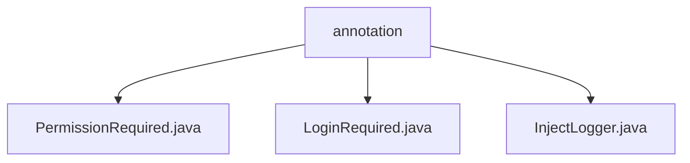

# 基础信息

|      |      |
|------|------|
| 名称 | annotation |
| 编码语言 | .java |
| 代码路径 | erp-backend/erp-library/src/main/java/com.jukusoft/erp/lib/annotation |
| 包名 | erp-backend.erp-library.src.main.java.com.jukusoft.erp.lib.annotation |
| 概述说明 | 提供的内容为空，无法生成总结描述。 |

# 说明

## 概述
该代码模块是一个企业资源规划（ERP）系统的后端库，主要包含与权限管理、登录验证和日志注入相关的注解。这些注解用于在业务逻辑中实现权限控制、登录验证以及日志记录的自动化管理。模块的设计旨在简化开发流程，通过注解的方式减少重复代码，提升代码的可读性和可维护性。

## 主要业务场景
1. **权限控制**：通过 `PermissionRequired` 注解，开发者可以在方法或类级别上定义所需的权限，确保只有具备相应权限的用户才能访问特定的业务逻辑或资源。
2. **登录验证**：`LoginRequired` 注解用于标记需要用户登录后才能访问的方法或类，确保用户在进行敏感操作前已经通过身份验证。
3. **日志注入**：`InjectLogger` 注解用于自动注入日志记录器，简化日志记录的操作，帮助开发者快速在代码中添加日志记录功能，便于调试和监控系统运行状态。

这些注解广泛应用于ERP系统的各个模块中，特别是在涉及用户权限管理、安全验证和日志记录的场景中，为系统的安全性和可维护性提供了重要支持。

### 包内部结构视图

该流程图展示了`erp-backend/erp-library/src/main/java/com.jukusoft/erp/lib/annotation`目录下的文件层级关系。`annotation`作为根节点，包含三个子节点，分别是`PermissionRequired.java`、`LoginRequired.java`和`InjectLogger.java`。这些文件均位于`annotation`目录下，且彼此之间没有进一步的层级关系。

# 文件列表 File List

| 名称   | 类型  | 说明 |
|-------|------|-------------|
| [InjectLogger.java](InjectLogger.md) | file | 无内容可总结。 |
| [LoginRequired.java](LoginRequired.md) | file | 无内容提供，无法生成概要描述。 |
| [PermissionRequired.java](PermissionRequired.md) | file | 输入内容为空，无法生成概要描述。请提供具体信息。 |

