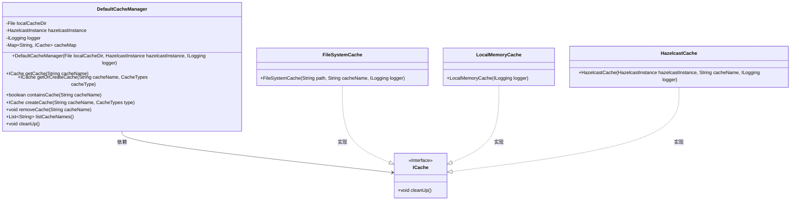
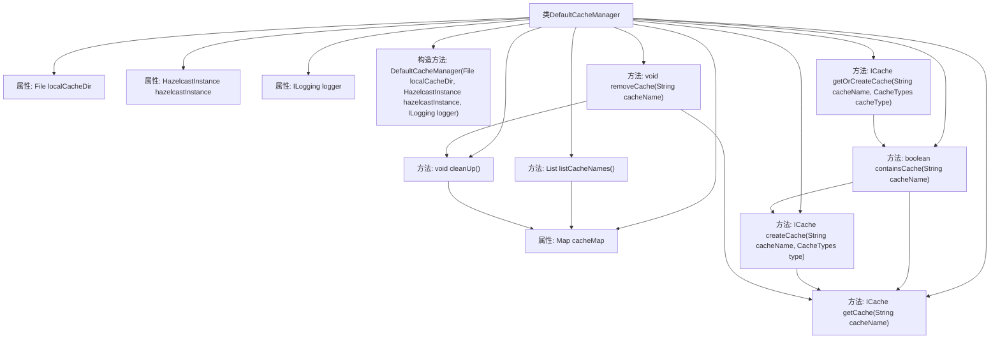

# 基础信息

|      |      |
|------|------|
| 名称 | DefaultCacheManager |
| 编码语言 | .java |
| 代码路径 | erp-backend/erp-library/src/main/java/com.jukusoft/erp/lib/cache/impl/DefaultCacheManager.java |
| 包名 | com.jukusoft.erp.lib.cache.impl |
| 依赖项 | ['com.hazelcast.core.HazelcastInstance', 'com.jukusoft.erp.lib.cache.CacheManager', 'com.jukusoft.erp.lib.cache.CacheTypes', 'com.jukusoft.erp.lib.cache.ICache', 'com.jukusoft.erp.lib.logging.ILogging', 'java.io.File', 'java.util.ArrayList', 'java.util.List', 'java.util.Map', 'java.util.concurrent.ConcurrentHashMap'] |
| 概述说明 | DefaultCacheManager支持文件、内存和Hazelcast缓存类型。 |

# 说明

DefaultCacheManager是一个用于管理缓存的工具，支持多种缓存类型，包括文件缓存、本地内存缓存以及Hazelcast分布式缓存。它提供了灵活的缓存管理功能，能够满足不同场景下的缓存需求，确保系统在性能和资源利用上达到最佳平衡。

# 类列表 Class Summary

| 名称   | 类型  | 说明 |
|-------|------|-------------|
| DefaultCacheManager | class | DefaultCacheManager管理缓存，支持文件、本地内存和Hazelcast缓存类型。 |

## 类 DefaultCacheManager

|      |      |
|------|------|
| 访问范围 | public |
| 类型 | class |
| 名称 | DefaultCacheManager |
| 说明 | DefaultCacheManager管理缓存，支持文件、本地内存和Hazelcast缓存类型。 |

### UML类图

这段代码定义了一个 `DefaultCacheManager` 类，用于管理不同类型的缓存实例。它依赖于 `ICache` 接口，并通过 `FileSystemCache`、`LocalMemoryCache` 和 `HazelcastCache` 类实现具体的缓存功能。`DefaultCacheManager` 提供了创建、获取、删除缓存，以及清理缓存的方法。该类通过 `ConcurrentHashMap` 来存储缓存实例，并支持多种缓存类型，包括文件缓存、本地内存缓存和 Hazelcast 分布式缓存。

### 内部方法调用关系图

该流程图展示了`DefaultCacheManager`类的结构和主要方法调用关系。`DefaultCacheManager`类负责管理不同类型的缓存实例，包括文件缓存、本地内存缓存和Hazelcast缓存。类中定义了多个方法，如`getCache`、`getOrCreateCache`、`createCache`等，用于获取、创建、删除和清理缓存。流程图清晰地展示了各个方法之间的调用关系，帮助理解类的内部逻辑和功能。

### 字段列表 Field List

| 名称  | 类型  | 说明 |
|-------|-------|------|
| localCacheDir = null | File | 本地缓存目录变量声明为受保护类型。 |
| logger = null | ILogging | 保护日志记录器变量初始化为空。 |
| hazelcastInstance = null | HazelcastInstance | 保护性声明Hazelcast实例初始化为空。 |
| cacheMap = new ConcurrentHashMap<>() | Map<String,ICache> | 使用ConcurrentHashMap保护并管理多个ICache实例。 |

### 方法列表 Method List

| 名称  | 类型  | 说明 |
|-------|-------|------|
| getOrCreateCache | ICache | 获取或创建指定名称和类型的缓存。 |
| cleanUp | void | 该方法遍历缓存映射并调用每个缓存的清理方法。 |
| containsCache | boolean | 该方法检查指定缓存是否存在，存在则返回true。 |
| removeCache | void | 移除指定缓存并从缓存映射中删除，必要时清理缓存。 |
| createCache | ICache | 方法检查缓存是否存在，根据类型创建并返回相应缓存实例。 |
| listCacheNames | List<String> | 该方法遍历缓存映射，将缓存名称加入列表并返回。 |
| getCache | ICache | 重写getCache方法，根据cacheName从cacheMap获取缓存。 |

