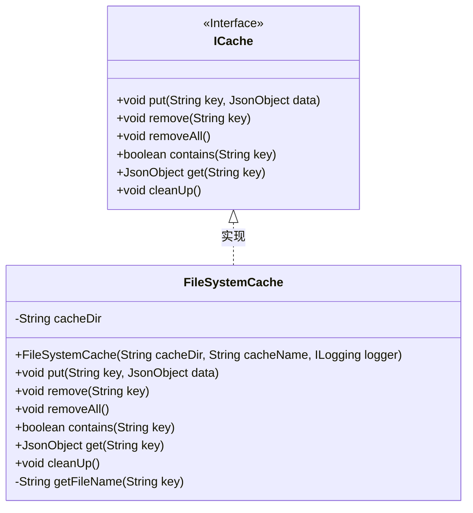
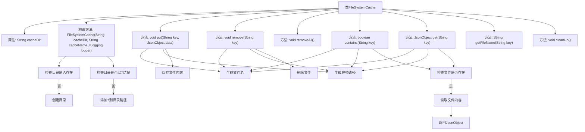

# 基础信息

|      |      |
|------|------|
| 名称 | FileSystemCache |
| 编码语言 | .java |
| 代码路径 | erp-backend/erp-library/src/main/java/com.jukusoft/erp/lib/cache/impl/FileSystemCache.java |
| 包名 | com.jukusoft.erp.lib.cache.impl |
| 依赖项 | ['com.jukusoft.erp.lib.cache.ICache', 'com.jukusoft.erp.lib.logging.ILogging', 'com.jukusoft.erp.lib.utils.FileUtils', 'com.jukusoft.erp.lib.utils.HashUtils', 'io.vertx.core.json.JsonObject', 'java.io.File', 'java.io.IOException', 'java.nio.charset.StandardCharsets'] |
| 概述说明 | FileSystemCache类实现ICache接口，支持文件系统缓存的增删查操作。 |

# 说明

FileSystemCache类实现了ICache接口，提供了基于文件系统的缓存功能。该类支持对缓存数据进行增加、删除和查询操作，确保用户能够有效地管理和访问缓存内容。通过文件系统实现缓存，提供了持久化存储的能力，适用于需要长期保存和快速检索数据的场景。

# 类列表 Class Summary

| 名称   | 类型  | 说明 |
|-------|------|-------------|
| FileSystemCache | class | FileSystemCache类实现ICache接口，提供文件系统缓存功能，支持增删查操作。 |

## 类 FileSystemCache

|      |      |
|------|------|
| 访问范围 | public |
| 类型 | class |
| 名称 | FileSystemCache |
| 说明 | FileSystemCache类实现ICache接口，提供文件系统缓存功能，支持增删查操作。 |

### UML类图

类图描述：  
`FileSystemCache` 类实现了 `ICache` 接口，用于将缓存数据存储在文件系统中。它包含一个 `cacheDir` 属性，表示缓存文件的存储目录。类中提供了 `put`、`remove`、`contains`、`get` 等方法，用于缓存数据的增删改查操作。`getFileName` 方法用于根据键生成唯一的文件名。`FileSystemCache` 通过实现 `ICache` 接口，提供了对缓存数据的基本操作功能。

### 内部方法调用关系图

这段代码实现了一个基于文件系统的缓存类 `FileSystemCache`，提供了缓存数据的存储、删除、查询等功能。通过构造方法初始化缓存目录，`put` 方法将数据存储为文件，`remove` 方法删除指定缓存文件，`contains` 方法检查缓存是否存在，`get` 方法读取缓存数据并返回。流程图展示了类的主要方法和内部逻辑调用关系，清晰地反映了代码的执行流程。

### 字段列表 Field List

| 名称  | 类型  | 说明 |
|-------|-------|------|
| cacheDir = "" | String | 定义了一个受保护的字符串变量cacheDir，初始值为空。 |

### 方法列表 Method List

| 名称  | 类型  | 说明 |
|-------|-------|------|
| removeAll | void | 重写removeAll方法，当前为空实现。 |
| cleanUp | void | 重写cleanUp方法，计划清空缓存目录。 |
| remove | void | 该方法通过键获取文件名，生成路径并删除对应文件。 |
| contains | boolean | 检查指定键对应的文件是否存在。 |
| get | JsonObject | 根据键获取文件名，生成路径，读取文件并返回Json对象。 |
| getFileName | String | 方法`getFileName`通过MD5哈希生成文件名并附加`.tmp`后缀。 |
| put | void | 该方法用于将JSON对象存储到指定路径的文件中。 |

