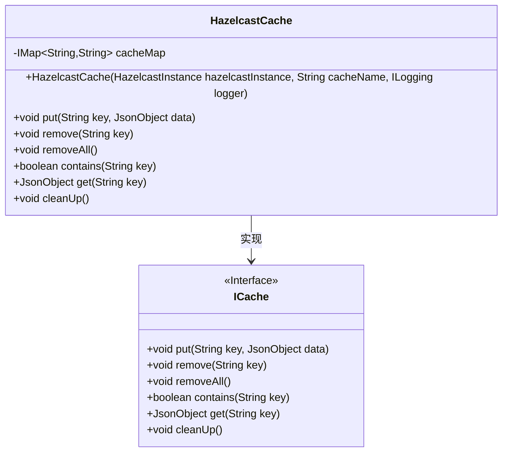
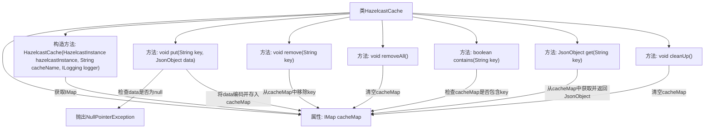

# 基础信息

|      |      |
|------|------|
| 名称 | HazelcastCache |
| 编码语言 | .java |
| 代码路径 | erp-backend/erp-library/src/main/java/com.jukusoft/erp/lib/cache/impl/HazelcastCache.java |
| 包名 | com.jukusoft.erp.lib.cache.impl |
| 依赖项 | ['com.hazelcast.core.HazelcastInstance', 'com.hazelcast.core.IMap', 'com.jukusoft.erp.lib.cache.ICache', 'com.jukusoft.erp.lib.logging.ILogging', 'io.vertx.core.json.JsonObject'] |
| 概述说明 | HazelcastCache类实现ICache接口，支持缓存添加、删除、查询和清理操作。 |

# 说明

HazelcastCache类实现了ICache接口，提供了全面的缓存操作功能。该类支持添加、删除、查询和清理缓存数据，确保缓存系统的高效管理和使用。通过实现ICache接口，HazelcastCache类能够与其他缓存系统无缝集成，提供一致的操作体验。这些功能使得HazelcastCache类在需要缓存管理的应用中非常实用和灵活。

# 类列表 Class Summary

| 名称   | 类型  | 说明 |
|-------|------|-------------|
| HazelcastCache | class | HazelcastCache类实现ICache接口，提供缓存操作功能，包括添加、删除、查询和清理。 |

## 类 HazelcastCache

|      |      |
|------|------|
| 访问范围 | public |
| 类型 | class |
| 名称 | HazelcastCache |
| 说明 | HazelcastCache类实现ICache接口，提供缓存操作功能，包括添加、删除、查询和清理。 |

### UML类图

类图描述：  
`HazelcastCache` 类实现了 `ICache` 接口，提供了缓存操作的基本功能。它通过 `IMap` 对象来存储键值对，并提供了 `put`、`remove`、`removeAll`、`contains`、`get` 和 `cleanUp` 等方法。`HazelcastCache` 的构造函数接收 `HazelcastInstance`、`cacheName` 和 `ILogging` 参数，用于初始化缓存映射。`ICache` 接口定义了缓存操作的标准方法，`HazelcastCache` 实现了这些方法以提供具体的缓存功能。

### 内部方法调用关系图

这段代码定义了一个`HazelcastCache`类，实现了`ICache`接口，用于管理缓存数据。类中包含一个`IMap`类型的`cacheMap`属性，用于存储键值对。构造方法通过`HazelcastInstance`实例和缓存名称初始化`cacheMap`。类提供了多种方法，如`put`、`remove`、`removeAll`、`contains`、`get`和`cleanUp`，分别用于添加、移除、清空、检查、获取缓存数据以及清理缓存。每个方法都直接操作`cacheMap`，确保数据的正确管理和操作。

### 字段列表 Field List

| 名称  | 类型  | 说明 |
|-------|-------|------|
| cacheMap = null | IMap<String,String> | 保护类型IMap的cacheMap变量初始化为null。 |

### 方法列表 Method List

| 名称  | 类型  | 说明 |
|-------|-------|------|
| contains | boolean | 该方法检查缓存中是否包含指定键。 |
| cleanUp | void | 清理缓存，清空缓存映射。 |
| removeAll | void | 重写方法，清空缓存映射。 |
| put | void | 重写put方法，检查JsonObject非空后存入缓存。 |
| get | JsonObject | 重写get方法，返回指定key的JsonObject对象。 |
| remove | void | 重写remove方法，删除缓存中指定键的值。 |

