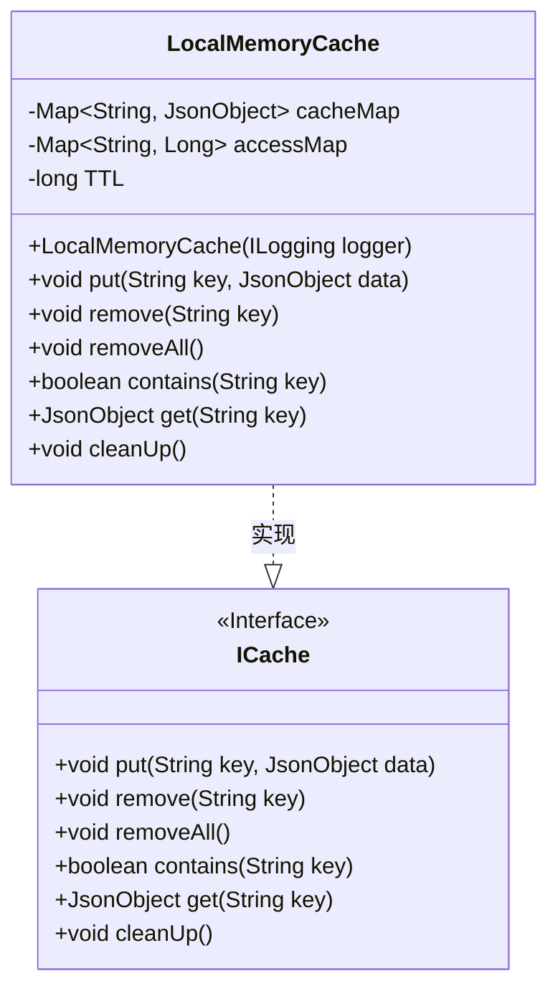
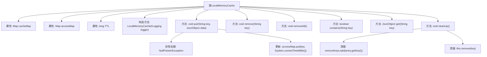

# 基础信息

|      |      |
|------|------|
| 名称 | LocalMemoryCache |
| 编码语言 | .java |
| 代码路径 | erp-backend/erp-library/src/main/java/com.jukusoft/erp/lib/cache/impl/LocalMemoryCache.java |
| 包名 | com.jukusoft.erp.lib.cache.impl |
| 依赖项 | ['com.jukusoft.erp.lib.cache.ICache', 'com.jukusoft.erp.lib.logging.ILogging', 'io.vertx.core.json.JsonObject', 'java.util.ArrayList', 'java.util.List', 'java.util.Map', 'java.util.concurrent.ConcurrentHashMap'] |
| 概述说明 | LocalMemoryCache实现ICache，用ConcurrentHashMap存数据，支持增删查，定期清理过期。 |

# 说明

LocalMemoryCache类实现了ICache接口，利用ConcurrentHashMap来存储缓存数据和访问时间。该类支持增加、删除和查询缓存数据的操作，并具备定期清理过期数据的功能，确保缓存的有效性和及时性。

# 类列表 Class Summary

| 名称   | 类型  | 说明 |
|-------|------|-------------|
| LocalMemoryCache | class | LocalMemoryCache类实现ICache接口，使用ConcurrentHashMap存储缓存数据和访问时间，支持增删查操作，并定期清理过期数据。 |

## 类 LocalMemoryCache

|      |      |
|------|------|
| 访问范围 | public |
| 类型 | class |
| 名称 | LocalMemoryCache |
| 说明 | LocalMemoryCache类实现ICache接口，使用ConcurrentHashMap存储缓存数据和访问时间，支持增删查操作，并定期清理过期数据。 |

### UML类图

这段代码定义了一个名为 `LocalMemoryCache` 的类，该类实现了 `ICache` 接口。`LocalMemoryCache` 类使用两个 `ConcurrentHashMap` 来存储缓存数据和最后访问时间戳，并提供了缓存的基本操作，如添加、删除、检查存在性、获取数据以及清理过期数据。`cleanUp` 方法会遍历所有缓存项，移除那些超过生存时间（TTL）的项。`LocalMemoryCache` 类通过实现 `ICache` 接口，确保了缓存操作的一致性和可扩展性。

### 内部方法调用关系图

这段代码实现了一个本地内存缓存系统，主要功能包括缓存数据的存储、删除、查询和清理。缓存数据存储在`cacheMap`中，并记录了每个缓存项的最后访问时间`accessMap`。`cleanUp`方法会根据缓存项的生存时间（TTL）自动清理过期的缓存。`put`方法在插入数据时会检查数据是否为`null`，并更新最后访问时间。`get`方法在获取数据时也会更新最后访问时间。`remove`和`removeAll`方法分别用于删除单个缓存项和清空整个缓存。

### 字段列表 Field List

| 名称  | 类型  | 说明 |
|-------|-------|------|
| accessMap = new ConcurrentHashMap<>() | Map<String,Long> | 使用ConcurrentHashMap保护线程安全的访问映射。 |
| TTL = 30 * 1000 | long | 保护长整型变量TTL，初始值为30000毫秒。 |
| cacheMap = new ConcurrentHashMap<>() | Map<String,JsonObject> | 使用ConcurrentHashMap保护缓存Map的线程安全。 |

### 方法列表 Method List

| 名称  | 类型  | 说明 |
|-------|-------|------|
| removeAll | void | 该方法清除缓存映射和访问映射中的所有数据。 |
| cleanUp | void | 清理缓存中过期的条目，避免并发修改异常。 |
| remove | void | 重写remove方法，删除缓存和访问记录中的指定键。 |
| contains | boolean | 重写contains方法，检查key在cacheMap中是否存在。 |
| get | JsonObject | 获取指定键的JSON对象，并更新访问时间戳。 |
| put | void | 重写put方法，检查JSON对象非空并更新缓存和访问时间戳。 |

