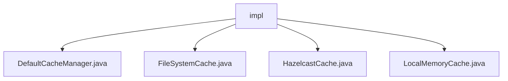

# 基础信息

|      |      |
|------|------|
| 名称 | impl |
| 编码语言 | .java |
| 代码路径 | erp-backend/erp-library/src/main/java/com.jukusoft/erp/lib/cache/impl |
| 包名 | erp-backend.erp-library.src.main.java.com.jukusoft.erp.lib.cache.impl |
| 概述说明 | DefaultCacheManager管理多种缓存类型，包括文件、内存和分布式缓存，确保系统性能优化。 |

# 说明

## 概述
该代码模块是一个用于管理缓存的工具集，提供了多种缓存类型的实现，包括文件缓存、本地内存缓存以及Hazelcast分布式缓存。通过实现统一的`ICache`接口，这些缓存类能够无缝集成，提供一致的缓存操作体验。`DefaultCacheManager`作为核心管理类，负责协调和管理这些缓存实例，确保系统在性能和资源利用上达到最佳平衡。

## 主要业务场景
1. **文件缓存**：通过`FileSystemCache`类实现，适用于需要长期保存和快速检索数据的场景。它提供了基于文件系统的缓存功能，支持对缓存数据进行增加、删除和查询操作，确保数据的持久化存储。
  
2. **本地内存缓存**：通过`LocalMemoryCache`类实现，利用`ConcurrentHashMap`来存储缓存数据和访问时间。该类支持增加、删除和查询缓存数据的操作，并具备定期清理过期数据的功能，适用于需要快速访问和高效管理的场景。

3. **分布式缓存**：通过`HazelcastCache`类实现，提供了全面的缓存操作功能，支持添加、删除、查询和清理缓存数据。该类适用于需要跨多个节点共享和管理缓存数据的分布式应用场景。

4. **缓存管理**：`DefaultCacheManager`作为核心管理类，支持多种缓存类型的统一管理，能够根据不同场景灵活选择缓存策略，确保系统的高效运行和资源的合理利用。

### 包内部结构视图

该流程图展示了`erp-backend/erp-library/src/main/java/com.jukusoft/erp/lib/cache/impl`目录下的文件层级关系。`impl`作为根节点，包含了四个子节点，分别是`DefaultCacheManager.java`、`FileSystemCache.java`、`HazelcastCache.java`和`LocalMemoryCache.java`。这些文件都属于缓存管理的具体实现类，展示了缓存管理的多种实现方式。

# 文件列表 File List

| 名称   | 类型  | 说明 |
|-------|------|-------------|
| [LocalMemoryCache.java](LocalMemoryCache.md) | file | LocalMemoryCache实现ICache，用ConcurrentHashMap存数据，支持增删查，定期清理过期。 |
| [HazelcastCache.java](HazelcastCache.md) | file | HazelcastCache类实现ICache接口，支持缓存添加、删除、查询和清理操作。 |
| [DefaultCacheManager.java](DefaultCacheManager.md) | file | DefaultCacheManager支持文件、内存和Hazelcast缓存类型。 |
| [FileSystemCache.java](FileSystemCache.md) | file | FileSystemCache类实现ICache接口，支持文件系统缓存的增删查操作。 |

