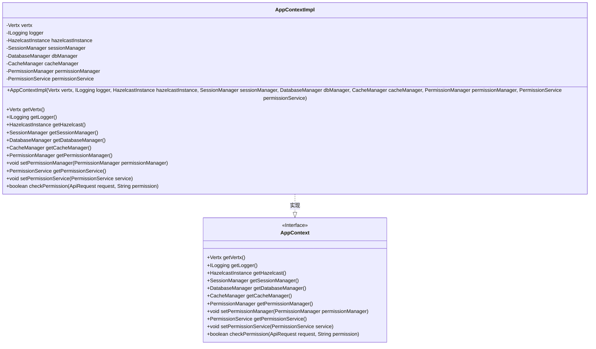

# 基础信息

|      |      |
|------|------|
| 名称 | AppContextImpl |
| 编码语言 | .java |
| 代码路径 | erp-backend/erp-library/src/main/java/com.jukusoft/erp/lib/context/AppContextImpl.java |
| 包名 | com.jukusoft.erp.lib.context |
| 依赖项 | ['com.hazelcast.core.HazelcastInstance', 'com.jukusoft.erp.lib.cache.CacheManager', 'com.jukusoft.erp.lib.context.AppContext', 'com.jukusoft.erp.lib.database.DatabaseManager', 'com.jukusoft.erp.lib.logging.ILogging', 'com.jukusoft.erp.lib.message.request.ApiRequest', 'com.jukusoft.erp.lib.permission.PermissionManager', 'com.jukusoft.erp.lib.permission.PermissionService', 'com.jukusoft.erp.lib.session.SessionManager', 'io.vertx.core.Vertx', 'io.vertx.core.json.JsonArray'] |
| 概述说明 | AppContextImpl管理Vertx、日志、Hazelcast、会话、数据库、缓存和权限服务。 |

# 说明

AppContextImpl实现了AppContext接口，负责管理和协调多个关键服务组件。这些组件包括Vertx用于事件驱动编程，日志服务用于记录系统运行信息，Hazelcast用于分布式数据存储和计算，会话管理用于维护用户会话状态，数据库服务用于数据持久化，缓存服务用于提升数据访问效率，以及权限管理用于控制用户访问权限。通过集成这些服务，AppContextImpl确保了系统的高效运行和资源的统一管理。

# 类列表 Class Summary

| 名称   | 类型  | 说明 |
|-------|------|-------------|
| AppContextImpl | class | AppContextImpl实现AppContext，管理Vertx、日志、Hazelcast、会话、数据库、缓存、权限等服务。 |

## 类 AppContextImpl

|      |      |
|------|------|
| 访问范围 | public |
| 类型 | class |
| 名称 | AppContextImpl |
| 说明 | AppContextImpl实现AppContext，管理Vertx、日志、Hazelcast、会话、数据库、缓存、权限等服务。 |

### UML类图

**描述：**  
`AppContextImpl` 类实现了 `AppContext` 接口，提供了对多种服务的管理和访问功能，包括 `Vertx`、`ILogging`、`HazelcastInstance`、`SessionManager`、`DatabaseManager`、`CacheManager`、`PermissionManager` 和 `PermissionService`。通过构造函数初始化这些服务，并提供相应的 `getter` 和 `setter` 方法。`checkPermission` 方法用于检查用户是否具有特定权限，并在必要时加载权限。

### 内部方法调用关系图

```mermaid
graph TD
    A["类AppContextImpl"]
    B["属性: Vertx vertx"]
    C["属性: ILogging logger"]
    D["属性: HazelcastInstance hazelcastInstance"]
    E["属性: SessionManager sessionManager"]
    F["属性: DatabaseManager dbManager"]
    G["属性: CacheManager cacheManager"]
    H["属性: PermissionManager permissionManager"]
    I["属性: PermissionService permissionService"]
    J["构造方法: AppContextImpl(Vertx, ILogging, HazelcastInstance, SessionManager, DatabaseManager, CacheManager, PermissionManager, PermissionService)"]
    K["方法: Vertx getVertx()"]
    L["方法: ILogging getLogger()"]
    M["方法: HazelcastInstance getHazelcast()"]
    N["方法: SessionManager getSessionManager()"]
    O["方法: DatabaseManager getDatabaseManager()"]
    P["方法: CacheManager getCacheManager()"]
    Q["方法: PermissionManager getPermissionManager()"]
    R["方法: void setPermissionManager(PermissionManager)"]
    S["方法: PermissionService getPermissionService()"]
    T["方法: void setPermissionService(PermissionService)"]
    U["方法: boolean checkPermission(ApiRequest, String)"]

    A --> B
    A --> C
    A --> D
    A --> E
    A --> F
    A --> G
    A --> H
    A --> I
    A --> J
    A --> K
    A --> L
    A --> M
    A --> N
    A --> O
    A --> P
    A --> Q
    A --> R
    A --> S
    A --> T
    A --> U
```

这段代码定义了一个名为`AppContextImpl`的类，它实现了`AppContext`接口。该类包含了多个属性，如`Vertx`、`ILogging`、`HazelcastInstance`等，并通过构造方法初始化这些属性。构造方法中还对每个传入的参数进行了非空检查，如果为空则抛出`NullPointerException`。类中还定义了一系列的getter和setter方法，用于获取和设置这些属性的值。此外，`checkPermission`方法用于检查用户是否具有某个权限，并在必要时初始化权限列表。

### 字段列表 Field List

| 名称  | 类型  | 说明 |
|-------|-------|------|
| vertx = null | Vertx | Vertx实例被声明为受保护且初始化为空。 |
| permissionManager = null | PermissionManager | 声明受保护的PermissionManager对象，初始值为null。 |
| dbManager = null | DatabaseManager | 保护类型的DatabaseManager实例dbManager初始化为空。 |
| hazelcastInstance = null | HazelcastInstance | Hazelcast实例初始化为空。 |
| cacheManager = null | CacheManager | 保护类型CacheManager实例cacheManager初始化为null。 |
| sessionManager = null | SessionManager | 保护会话管理器实例变量初始化为空。 |
| logger = null | ILogging | 声明一个受保护的日志记录器变量，初始化为空。 |
| permissionService = null | PermissionService | 保护权限服务实例为空。 |

### 方法列表 Method List

| 名称  | 类型  | 说明 |
|-------|-------|------|
| getSessionManager | SessionManager | 重写方法返回当前会话管理器实例。 |
| getHazelcast | HazelcastInstance | 该方法返回当前Hazelcast实例。 |
| getLogger | ILogging | 重写getLogger方法，返回当前logger实例。 |
| getDatabaseManager | DatabaseManager | 重写getDatabaseManager方法，返回当前数据库管理器实例。 |
| setPermissionManager | void | 设置权限管理器，若为空则抛出空指针异常。 |
| getPermissionManager | PermissionManager | 重写getPermissionManager方法，返回当前权限管理器实例。 |
| getCacheManager | CacheManager | 该方法返回当前对象的cacheManager实例。 |
| setPermissionService | void | 重写方法，设置权限服务实例。 |
| getVertx | Vertx | 重写getVertx方法，返回当前vertx实例。 |
| getPermissionService | PermissionService | 重写getPermissionService方法，返回permissionService实例。 |
| checkPermission | boolean | 检查API请求权限，初始化并缓存用户权限，返回是否拥有指定权限。 |

