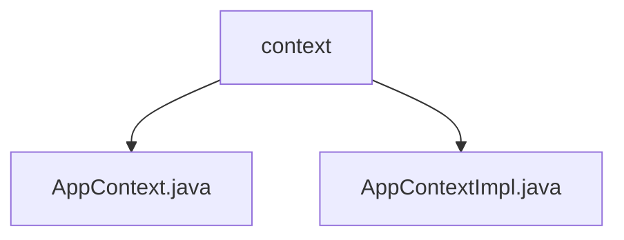

# 基础信息

|      |      |
|------|------|
| 名称 | context |
| 编码语言 | .java |
| 代码路径 | erp-backend/erp-library/src/main/java/com.jukusoft/erp/lib/context |
| 包名 | erp-backend.erp-library.src.main.java.com.jukusoft.erp.lib.context |
| 概述说明 | AppContextImpl管理Vertx、日志、Hazelcast、会话、数据库、缓存和权限服务。 |

# 说明

## 概述
该代码模块主要围绕`AppContext`接口及其实现类`AppContextImpl`展开，负责管理和协调多个关键服务组件。`AppContextImpl`通过集成Vertx、日志服务、Hazelcast、会话管理、数据库服务、缓存服务和权限管理等组件，确保系统的高效运行和资源的统一管理。

## 主要业务场景
1. **事件驱动编程**：通过Vertx实现事件驱动编程，提升系统的响应速度和并发处理能力。
2. **日志记录**：利用日志服务记录系统运行信息，便于监控和故障排查。
3. **分布式数据存储与计算**：使用Hazelcast进行分布式数据存储和计算，支持高可用性和扩展性。
4. **用户会话管理**：通过会话管理组件维护用户会话状态，确保用户操作的连续性和一致性。
5. **数据持久化**：数据库服务用于数据的持久化存储，保证数据的可靠性和完整性。
6. **数据缓存**：缓存服务用于提升数据访问效率，减少数据库的访问压力。
7. **权限控制**：权限管理组件用于控制用户访问权限，确保系统的安全性和合规性。

通过以上业务场景，`AppContextImpl`实现了对系统资源的统一管理和高效利用，支持复杂的业务需求和系统扩展。

### 包内部结构视图

该流程图展示了 `erp-backend/erp-library/src/main/java/com.jukusoft/erp/lib/context` 目录下的文件层级关系。`context` 是根节点，包含两个子节点 `AppContext.java` 和 `AppContextImpl.java`，分别表示该目录下的两个Java文件。

# 文件列表 File List

| 名称   | 类型  | 说明 |
|-------|------|-------------|
| [AppContextImpl.java](AppContextImpl.md) | file | AppContextImpl管理Vertx、日志、Hazelcast、会话、数据库、缓存和权限服务。 |
| [AppContext.java](AppContext.md) | file | 输入内容为空，无法生成概要描述。 |

