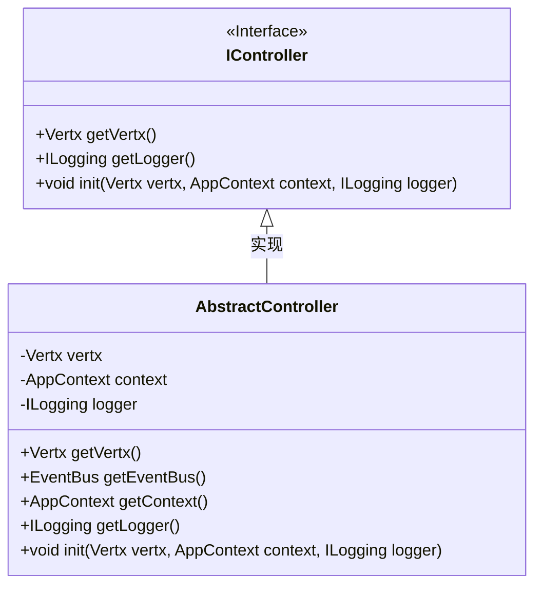
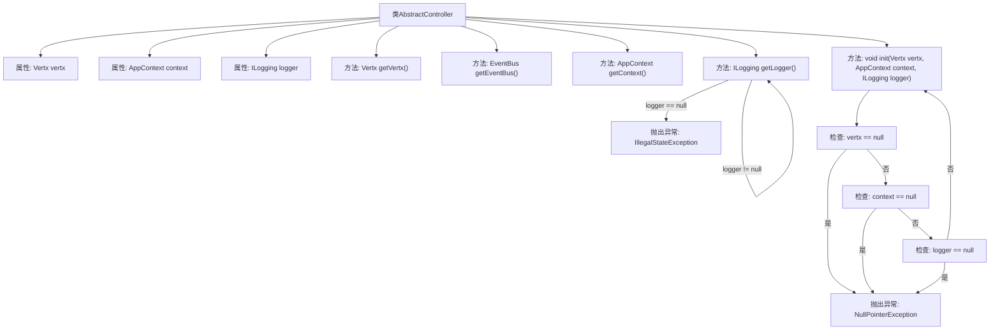

# 基础信息

|      |      |
|------|------|
| 名称 | AbstractController |
| 编码语言 | .java |
| 代码路径 | erp-backend/erp-library/src/main/java/com.jukusoft/erp/lib/controller/AbstractController.java |
| 包名 | com.jukusoft.erp.lib.controller |
| 依赖项 | ['com.jukusoft.erp.lib.context.AppContext', 'com.jukusoft.erp.lib.logging.ILogging', 'io.vertx.core.Vertx', 'io.vertx.core.eventbus.EventBus'] |
| 概述说明 | AbstractController实现IController，包含Vertx、AppContext和ILogging实例及初始化方法。 |

# 说明

AbstractController类实现了IController接口，包含Vertx、AppContext和ILogging三个实例，并提供了初始化方法。这些实例和方法共同构成了该类的核心功能，使其能够处理与Vertx框架相关的控制器逻辑，并利用AppContext进行应用上下文管理，同时通过ILogging实例进行日志记录。

# 类列表 Class Summary

| 名称   | 类型  | 说明 |
|-------|------|-------------|
| AbstractController | class | AbstractController类实现IController接口，包含Vertx、AppContext和ILogging实例及初始化方法。 |

## 类 AbstractController

|      |      |
|------|------|
| 访问范围 | public |
| 类型 | class |
| 名称 | AbstractController |
| 说明 | AbstractController类实现IController接口，包含Vertx、AppContext和ILogging实例及初始化方法。 |

### UML类图

这段代码定义了一个 `AbstractController` 类，该类实现了 `IController` 接口。`AbstractController` 类包含三个受保护的成员变量：`vertx`、`context` 和 `logger`，分别表示 Vert.x 实例、应用上下文和日志记录器。类中提供了获取这些实例的方法，并且 `init` 方法用于初始化这些变量，如果传入的参数为 `null`，则会抛出异常。通过类图可以清晰地看到 `AbstractController` 类与 `IController` 接口之间的实现关系。

### 内部方法调用关系图

这段代码定义了一个名为 `AbstractController` 的类，该类实现了 `IController` 接口。类中包含三个属性：`vertx`、`context` 和 `logger`，分别表示 Vertx 实例、应用上下文和日志记录器。类提供了多个方法，包括获取这些属性的方法以及一个初始化方法 `init`。`init` 方法会检查传入的参数是否为 `null`，如果是则抛出 `NullPointerException`。`getLogger` 方法在 `logger` 为 `null` 时会抛出 `IllegalStateException`。这段代码主要用于初始化和管理控制器的基础功能。

### 字段列表 Field List

| 名称  | 类型  | 说明 |
|-------|-------|------|
| vertx = null | Vertx | 保护类型的Vertx对象初始化为空。 |
| context = null | AppContext | 声明并初始化受保护的AppContext变量context为空。 |
| logger = null | ILogging | 保护性日志记录器初始化为空。 |

### 方法列表 Method List

| 名称  | 类型  | 说明 |
|-------|-------|------|
| getContext | AppContext | 获取当前应用上下文的方法。 |
| getEventBus | EventBus | 获取当前Vertx实例的事件总线对象。 |
| getVertx | Vertx | 重写getVertx方法，返回当前vertx实例。 |
| init | void | 初始化方法检查并设置vertx、context和logger，参数为空时抛出异常。 |
| getLogger | ILogging | 方法返回日志对象，未初始化时抛出异常。 |

