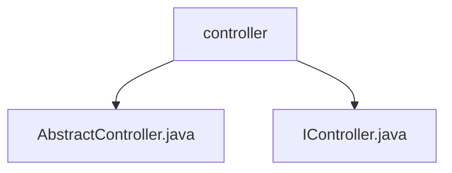

# 基础信息

|      |      |
|------|------|
| 名称 | controller |
| 编码语言 | .java |
| 代码路径 | erp-backend/erp-library/src/main/java/com.jukusoft/erp/lib/controller |
| 包名 | erp-backend.erp-library.src.main.java.com.jukusoft.erp.lib.controller |
| 概述说明 | AbstractController类实现IController接口，管理Vertx、AppContext和ILogging实例，提供初始化功能。 |

# 说明

## 概述

该代码模块主要围绕控制器（Controller）的设计与实现展开，核心类包括`AbstractController`和`IController`。`AbstractController`类实现了`IController`接口，集成了`Vertx`框架、`AppContext`应用上下文管理以及`ILogging`日志记录功能。通过这些组件的协同工作，`AbstractController`能够处理与`Vertx`框架相关的控制器逻辑，并提供了初始化方法以确保控制器在启动时能够正确配置和运行。

## 主要业务场景

该模块的主要业务场景包括：

1. **控制器逻辑处理**：`AbstractController`作为控制器的基类，负责处理与`Vertx`框架相关的请求和响应逻辑，确保业务逻辑能够正确执行。
2. **应用上下文管理**：通过`AppContext`实例，`AbstractController`能够访问和管理应用中的共享资源和配置信息，确保控制器在运行时能够获取所需的上下文数据。
3. **日志记录**：`ILogging`实例提供了日志记录功能，使得控制器在执行过程中能够记录关键操作和错误信息，便于后续的调试和监控。
4. **初始化与配置**：`AbstractController`提供了初始化方法，确保控制器在启动时能够正确配置并准备好处理请求。

该模块的设计旨在提供一个灵活且可扩展的控制器基础架构，支持在`Vertx`框架下构建复杂的业务逻辑，并通过日志记录和上下文管理增强系统的可维护性和可观测性。

### 包内部结构视图

该流程图展示了 `erp-backend/erp-library` 项目中 `controller` 文件夹下的文件层级关系。`controller` 文件夹包含两个文件：`AbstractController.java` 和 `IController.java`。这些文件是控制器相关的核心代码，分别定义了抽象控制器和控制器接口，用于统一管理和扩展控制器功能。

# 文件列表 File List

| 名称   | 类型  | 说明 |
|-------|------|-------------|
| [IController.java](IController.md) | file | 无内容，无法生成概要描述。 |
| [AbstractController.java](AbstractController.md) | file | AbstractController实现IController，包含Vertx、AppContext和ILogging实例及初始化方法。 |

