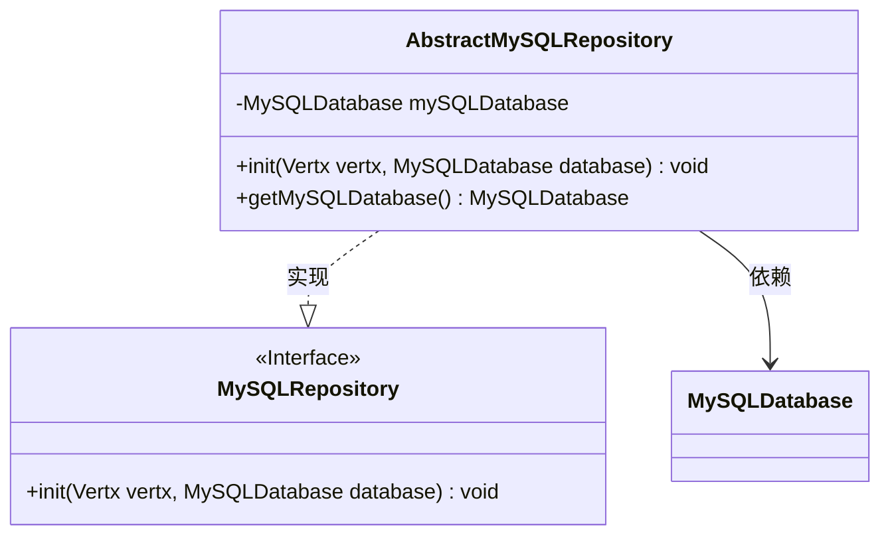
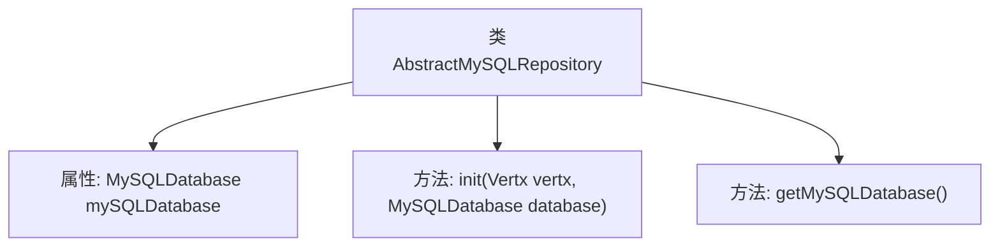

# 基础信息

|      |      |
|------|------|
| 名称 | AbstractMySQLRepository |
| 编码语言 | .java |
| 代码路径 | erp-backend/erp-library/src/main/java/com.jukusoft/erp/lib/database/AbstractMySQLRepository.java |
| 包名 | com.jukusoft.erp.lib.database |
| 依赖项 | ['com.jukusoft.erp.lib.database.MySQLDatabase', 'com.jukusoft.erp.lib.database.MySQLRepository', 'io.vertx.core.Vertx'] |
| 概述说明 | 抽象MySQL仓库类实现MySQL接口，提供初始化和获取数据库实例功能。 |

# 说明

抽象MySQL仓库类实现了MySQL接口，提供了初始化和获取数据库实例的方法。该类封装了与MySQL数据库的连接和操作，通过初始化方法可以配置数据库连接参数，而获取数据库实例方法则返回一个可用的数据库连接对象，便于后续的数据库操作。

# 类列表 Class Summary

| 名称   | 类型  | 说明 |
|-------|------|-------------|
| AbstractMySQLRepository | class | 抽象MySQL仓库类实现MySQL接口，包含初始化和获取数据库实例方法。 |

## 类 AbstractMySQLRepository

|      |      |
|------|------|
| 访问范围 | public |
| 类型 | class |
| 名称 | AbstractMySQLRepository |
| 说明 | 抽象MySQL仓库类实现MySQL接口，包含初始化和获取数据库实例方法。 |

### UML类图

这段代码定义了一个名为 `AbstractMySQLRepository` 的类，它实现了 `MySQLRepository` 接口。`AbstractMySQLRepository` 类包含一个私有的 `MySQLDatabase` 实例，并通过 `init` 方法初始化该实例。`getMySQLDatabase` 方法用于获取该实例。`MySQLRepository` 接口定义了 `init` 方法，`AbstractMySQLRepository` 类实现了该方法。类图展示了 `AbstractMySQLRepository` 类与 `MySQLRepository` 接口之间的实现关系，以及 `AbstractMySQLRepository` 类对 `MySQLDatabase` 类的依赖关系。

### 内部方法调用关系图

这段代码定义了一个名为 `AbstractMySQLRepository` 的类，该类实现了 `MySQLRepository` 接口。类中包含一个 `MySQLDatabase` 类型的私有属性 `mySQLDatabase`，并通过 `init` 方法初始化该属性。`getMySQLDatabase` 方法用于获取 `mySQLDatabase` 的实例。这段代码的主要作用是管理 MySQL 数据库的连接和初始化。

### 字段列表 Field List

| 名称  | 类型  | 说明 |
|-------|-------|------|
| mySQLDatabase = null | MySQLDatabase | 声明一个私有MySQL数据库对象并初始化为空。 |

### 方法列表 Method List

| 名称  | 类型  | 说明 |
|-------|-------|------|
| init | void | 初始化方法设置MySQL数据库实例。 |
| getMySQLDatabase | MySQLDatabase | 获取MySQL数据库实例的方法。 |

